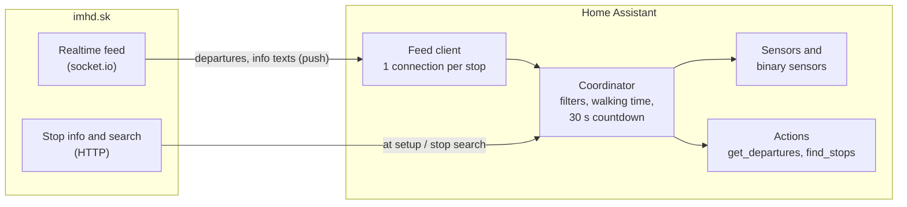

# IMHD.sk Departures for Home Assistant

[](https://hacs.xyz/docs/faq/custom_repositories)
[](https://www.home-assistant.io/)
[](https://github.com/jakubfabrici/ha-imhd/releases)
[](https://github.com/jakubfabrici/ha-imhd/actions/workflows/validate.yml)
[](https://github.com/jakubfabrici/ha-imhd/actions/workflows/tests.yml)
[](LICENSE)

Realtime public-transport departures from [imhd.sk](https://imhd.sk/) in Home
Assistant, for every Slovak city imhd.sk covers - Bratislava, Košice, Žilina,
Banská Bystrica, Prešov, Nitra and many more. Pick a stop and you get a
template-friendly departures sensor, the next line and its delay, "time to leave"
alerts that account for your walk to the stop, and imhd.sk service alerts. Data
is **pushed** from imhd.sk's own live feed: no add-on, MQTT broker, scraper or
browser in between.


> [!NOTE]
> This is an **unofficial** community project. It is not affiliated with,
> endorsed by or supported by imhd.sk. All departure data © imhd.sk. Please read
> [Privacy, fair use and disclaimer](#privacy-fair-use-and-disclaimer).

## Contents

- [Features](#features)
- [How it works](#how-it-works)
- [Requirements](#requirements)
- [Installation](#installation)
- [Configuration](#configuration)
- [Finding your stop ID](#finding-your-stop-id)
- [Supported cities](#supported-cities)
- [Entities](#entities)
- [The main sensor and its attributes](#the-main-sensor-and-its-attributes)
- [Templating guide](#templating-guide)
- [Dashboard examples](#dashboard-examples)
- [Automations](#automations)
- [Actions reference](#actions-reference)
- [openHASP display](#openhasp-display)
- [Troubleshooting and FAQ](#troubleshooting-and-faq)
- [Migrating from an old pyscript / MQTT setup](#migrating-from-an-old-pyscript--mqtt-setup)
- [Privacy, fair use and disclaimer](#privacy-fair-use-and-disclaimer)
- [Contributing](#contributing)
- [License](#license)

## Features

- **Realtime push updates** over imhd.sk's own socket.io feed - the same data
  the imhd.sk online departure boards show, updated the moment imhd.sk sends it.
  No polling.
- **All imhd.sk cities** (21 sections), see [Supported cities](#supported-cities).
- **Rich departure data:** expected and scheduled time, delay, realtime flag,
  platform, vehicle number, low-floor and air-conditioning flags, "vehicle stuck"
  flag, destination and the text imhd.sk displays.
- **Walking time and "time to leave":** departures you can no longer catch are
  hidden, every departure has a `leave_in` value, and a binary sensor turns on
  when it is time to go.
- **Service alerts:** imhd.sk info texts (diversions, outages) as a binary sensor
  with the messages.
- **Filters per stop:** platforms, lines, excluded lines, direction (case and
  diacritics insensitive) and the number of departures.
- **Per-departure sensors** (`Departure 1` … `Departure N`) for tiles and simple
  cards, plus a main sensor with the full list for templates.
- **Response actions:** `imhd.get_departures` and `imhd.find_stops` return data
  you can use in scripts and automations; `imhd.refresh` reconnects.
- **Diagnostics** download and repair issues for problems that need your attention.
- **YAML or UI configuration** - a simple `imhd.yaml` list or a guided config
  flow with stop search, nearest stops and imhd.sk link parsing.
- **English and Slovak** translations.
- Ready-made [examples](examples/): dashboards, template sensors, automations,
  a notification [blueprint](#time-to-leave-notification-blueprint) and an
  [openHASP](#openhasp-display) departure board.

## How it works

When a stop is set up, the integration loads the stop's details (name,
platforms) from imhd.sk once. It then opens **one** socket.io connection for the
stop and subscribes to its departure board. imhd.sk pushes the board whenever
something changes - a delay, a vehicle position, a new departure - together with
info texts and vehicle details.

Locally, the integration applies your filters and walking time, recomputes the
"minutes until departure" every 30 seconds and drops departed rows, so the
countdown keeps running between pushes. If the connection drops, it reconnects
with back-off (2 s up to 60 s); if nothing arrives for 5 minutes, it reconnects
on purpose.



## Requirements

- Home Assistant **2025.1** or newer.
- [HACS](https://hacs.xyz/) for the recommended installation (optional).
- Outbound internet access from Home Assistant to `https://imhd.sk` (HTTPS and
  WebSocket). No account or API key is needed.
- The Python dependency (`python-socketio`) is installed automatically.

## Installation

### HACS (recommended)

The integration is installed as a HACS *custom repository*.

1. Make sure [HACS](https://hacs.xyz/docs/use/) is installed.
2. Click the button below and confirm, **or** add the repository manually:

   [](https://my.home-assistant.io/redirect/hacs_repository/?owner=jakubfabrici&repository=ha-imhd&category=integration)

   Manually: open **HACS** → **⋮** (top right) → **Custom repositories**, enter
   `https://github.com/jakubfabrici/ha-imhd`, choose the type **Integration** and
   click **Add**.
3. Search HACS for **IMHD.sk Departures**, open it and click **Download**.
4. **Restart Home Assistant.**
5. Add your stops - in the [UI](#option-b-ui-config-flow) or in
   [YAML](#option-a-yaml-file).

Updates show up in HACS like for any other integration.

### Manual

1. Download the latest release from
   [Releases](https://github.com/jakubfabrici/ha-imhd/releases) (or clone the
   repository).
2. Copy the folder `custom_components/imhd` into your Home Assistant
   configuration directory, so that you end up with
   `<config>/custom_components/imhd/manifest.json`.
3. Restart Home Assistant and add your stops.

## Configuration

Every configured stop becomes one **device** with its own entities. You can mix
both ways of configuring stops.

### Option A: YAML file

Put your stops in a separate file and include it from `configuration.yaml`:

```yaml
# configuration.yaml
imhd: !include imhd.yaml
```

```yaml
# imhd.yaml - one list item per stop
- name: Hodzovo                 # device / entity name -> sensor.hodzovo_departures
  city: ba                      # section code (ba, ke, za, ...) or city name ("Bratislava")
  stop: 83                      # stop id, exact stop name, or an imhd.sk URL with ?st=
  platforms: ["*"]              # platform labels or ids; "*" = all (default)
  lines: []                     # only these lines (default: all)
  exclude_lines: []             # never these lines
  direction: []                 # destination must contain one of these texts
  max_departures: 10            # 1..30, size of the departures list
  walking_time: 3               # minutes to walk to the stop
  time_to_leave_window: 2       # "Time to leave" turns on this many minutes before you must leave
  departure_sensors: 3          # 0..10 extra "Departure N" sensors

- name: Hurbanova
  city: za
  stop: "https://imhd.sk/za/online-zastavkova-tabula?st=1831"
  direction: ["Stodolova", "Jaseňová"]
  exclude_lines: ["50"]
```

A longer, annotated example with three cities is in
[`examples/imhd.yaml`](examples/imhd.yaml).

| Option | Type | Default | Description |
|---|---|---|---|
| `name` | string | stop name | Name of the device. Entity ids are built from it: `Hodzovo` → `sensor.hodzovo_departures`. |
| `city` | string | **required** | imhd.sk section code (`ba`, `ke`, `za`, …) or the city name (`Košice`). See [Supported cities](#supported-cities). |
| `stop` | int / string | **required** | Stop ID (`83`), the exact stop name (`Hodžovo nám.`) or any imhd.sk URL containing `st=` (the city in the URL wins). |
| `platforms` | list of strings | `["*"]` (all) | Only departures from these platforms. Use the labels shown on imhd.sk (`A`, `B`, `1`, …) or platform ids. |
| `lines` | list of strings | `[]` (all) | Only these lines. Exact match, case-insensitive. Quote numbers: `["9", "X13"]`. |
| `exclude_lines` | list of strings | `[]` | Never show these lines. |
| `direction` | string or list | `[]` (all) | Only departures whose destination contains one of these texts. Case and diacritics are ignored (`petrzalka` matches `Petržalka`). |
| `max_departures` | int, 1-30 | `10` | How many departures the main sensor lists in its attributes. |
| `walking_time` | int, minutes | `0` | Time you need to reach the stop. When > 0, departures you cannot catch any more (`leave_in < 0`) are hidden. |
| `time_to_leave_window` | int, minutes | `2` | The **Time to leave** binary sensor is on while `0 ≤ leave_in ≤ window` for the next catchable departure. |
| `departure_sensors` | int, 0-10 | `3` | Number of `Departure 1` … `Departure N` sensors. |

How YAML stops behave:

- On start-up every list item is imported into a regular config entry, so YAML
  stops also show up under **Settings → Devices & services**.
- To change a YAML stop, edit `imhd.yaml` and restart Home Assistant; the
  imported entry is updated. Treat YAML as the source of truth for those stops.
- If you remove a stop from YAML, a repair issue suggests deleting its entry.
- You can configure the same stop more than once with different names and
  filters, e.g. one device per platform or per direction.

### Option B: UI (config flow)

[](https://my.home-assistant.io/redirect/config_flow_start/?domain=imhd)

Or go to **Settings → Devices & services → Add integration** and search for
**IMHD.sk Departures**.

1. **City and method.** Pick the city and how to find the stop: *Search by
   name*, *Nearest to my home location*, *Nearest to a point on the map* or
   *Stop ID or imhd.sk URL*.

   

2. **Pick the stop.** Choose from the list (name, city, platforms and distance)
   or enter the stop ID / paste an imhd.sk link.

   

3. **Settings.** Name, platforms, lines, excluded lines, direction, number of
   departures, walking time, time-to-leave window and per-departure sensors -
   the same options as in YAML.

   

Afterwards you can:

- change the filters with **Configure** on the integration entry, and
- move the entry to another stop with **⋮ → Reconfigure** (name and filters are kept).


## Finding your stop ID

You rarely need the ID itself - the config flow can search by name and list
nearby stops - but for YAML it is handy:

1. **From imhd.sk.** Open the online departure board of your city, e.g.
   <https://imhd.sk/ba/online-zastavkova-tabula> (*Online zastávková tabuľa*),
   choose your stop and look at the address bar:
   `https://imhd.sk/ba/online-zastavkova-tabula?st=83`. The number after `st=` is
   the stop ID; you can also paste the whole URL into `stop:` or the config flow.
2. **Nearest stops.** In the config flow choose *Nearest to my home location* or
   *Nearest to a point on the map*.
3. **With the `imhd.find_stops` action.** In **Developer tools → Actions** run:

   ```yaml
   action: imhd.find_stops
   data:
     city: ba
     query: Hodžovo
   ```

   or leave out `query` to get the five stops nearest to your home (or to
   `latitude` / `longitude`). See [`imhd.find_stops`](#imhdfind_stops).

## Supported cities

`city` accepts the section code or the city name.

| Code | City | Code | City | Code | City |
|---|---|---|---|---|---|
| `ba` | Bratislava | `nr` | Nitra | `si` | Skalica |
| `bb` | Banská Bystrica | `nz` | Nové Zámky | `sn` | Spišská Nová Ves |
| `hc` | Hlohovec | `pb` | Považská Bystrica | `tatry` | Poprad-Tatry |
| `ke` | Košice | `pd` | Prievidza | `tn` | Trenčín |
| `lm` | Liptovský Mikuláš | `pn` | Piešťany | `tt` | Trnava |
| `mt` | Martin | `po` | Prešov | `za` | Žilina |
| `rk` | Ružomberok | `se` | Senica | `zv` | Zvolen |

Whether departures are *realtime* (vehicle tracked, with delays) or
*timetable-only* depends on the city, operator and line. Timetable-only
departures have `realtime: false` and `delay: null`; everything else works the same.
Where imhd.sk has no platform labels for a stop, `platform` holds the numeric
platform id.

## Entities

Example ids for a stop named **Hodzovo**. Entity ids are built from the device
name and the entity name; check **Settings → Entities** for your actual ids.

| Entity | Name | State | Attributes |
|---|---|---|---|
| `sensor.hodzovo_departures` | Departures | Minutes until the next departure (`unknown` when there is none) | The full departure list and summary fields - see [below](#the-main-sensor-and-its-attributes). |
| `sensor.hodzovo_next_departure` | Next departure | Timestamp of the next departure (shown as "in 4 minutes") | `line`, `destination`, `time`, `departure`, `minutes`, `delay`, `platform` |
| `sensor.hodzovo_next_line` | Next line | Line of the next departure, e.g. `44` | same as above |
| `sensor.hodzovo_delay` | Delay | Delay of the next departure in minutes; `unknown` when timetable-only | same as above |
| `sensor.hodzovo_departure_1` … `_N` | Departure 1 … N | Minutes until the N-th departure | All [departure fields](#departure-fields) of that departure. N = `departure_sensors`. |
| `binary_sensor.hodzovo_time_to_leave` | Time to leave | `on` while `0 ≤ leave_in ≤ time_to_leave_window` for the next catchable departure | `line`, `destination`, `departure`, `leave_in` |
| `binary_sensor.hodzovo_realtime_connected` | Realtime connection | `on` while connected to the imhd.sk feed (diagnostic, *connectivity*) | `last_message`, `reconnects` |
| `binary_sensor.hodzovo_disruption` | Service alert | `on` while imhd.sk shows info texts for the stop (*problem*) | `messages` |

All entities carry the attribution "Data: imhd.sk". They become unavailable
when the integration has no trustworthy data (for example after a long
disconnect).

## The main sensor and its attributes

`sensor.hodzovo_departures` is designed for templates. Its state is the number
of minutes until the next departure; its attributes contain everything else.
This is what **Developer tools → States** shows for the stop at 07:58 on a
Monday (six departures on the board; some are abbreviated with `# ...`):


```yaml
stop_name: Hodžovo nám.
stop_id: 83
city: Bratislava
section: ba
platforms: [A, B, C, D]
departures:
  - line: "44"
    destination: Koliba
    destination_city: Bratislava
    departure: "2026-10-05T08:02:00+02:00"
    scheduled: "2026-10-05T08:01:00+02:00"
    time: "08:02"
    scheduled_time: "08:01"
    minutes: 4
    leave_in: 1
    delay: 1
    realtime: true
    platform: A
    vehicle: "6127"
    low_floor: false
    air_conditioning: false
    stuck: false
    text: 4 min
    trip_id: 18185607
  - line: "42"
    destination: Cintorín Vrakuňa
    destination_city: Bratislava
    departure: "2026-10-05T08:04:00+02:00"
    scheduled: "2026-10-05T08:04:00+02:00"
    time: "08:04"
    scheduled_time: "08:04"
    minutes: 6
    leave_in: 3
    delay: 0
    realtime: true
    platform: A
    vehicle: "6813"
    low_floor: true
    air_conditioning: true
    stuck: false
    text: 6 min
    trip_id: 18474013
  - line: "47"
    destination: Zimný štadión
    # ... time 08:08, minutes 10, leave_in 7, delay 3, realtime true, platform B, low_floor true
  - line: "44"
    destination: Koliba
    departure: "2026-10-05T08:11:00+02:00"
    scheduled: "2026-10-05T08:11:00+02:00"
    time: "08:11"
    minutes: 13
    leave_in: 10
    delay: null            # timetable-only departure
    realtime: false
    vehicle: null
    low_floor: null        # unknown
    air_conditioning: null
    # ...
  - line: "42"
    destination: Cintorín Vrakuňa
    # ... time 08:19, minutes 21, leave_in 18, delay 0, realtime true, platform A
  - line: "44"
    destination: Koliba
    # ... time 08:23, minutes 25, leave_in 22, timetable-only
next_line: "44"
next_destination: Koliba
next_time: "08:02"
next_departure: "2026-10-05T08:02:00+02:00"
next_minutes: 4
next_delay: 1
next_realtime: true
next_platform: A
lines: ["42", "44", "47"]
departure_count: 6
info: []
connected: true
last_update: "2026-10-05T07:57:48+02:00"
attribution: "Data: imhd.sk"
unit_of_measurement: min
friendly_name: Hodzovo Departures
```

This example stop uses `walking_time: 3` and `time_to_leave_window: 2`, so
`binary_sensor.hodzovo_time_to_leave` is `on` (the 44 at 08:02 has
`leave_in: 1`).

### Attributes

| Attribute | Type | Description |
|---|---|---|
| `stop_name`, `stop_id` | string, int | Stop as named on imhd.sk and its ID. |
| `city`, `section` | string | City name and imhd.sk section code. |
| `platforms` | list | Platform labels covered (your filter, or all platforms of the stop). |
| `departures` | list | Up to `max_departures` departures after filters, sorted by expected departure. See [Departure fields](#departure-fields). |
| `next_line`, `next_destination`, `next_time`, `next_departure`, `next_minutes`, `next_delay`, `next_realtime`, `next_platform` | various | Shortcuts for the first departure (`null` when there is none). |
| `lines` | list | Sorted unique lines in `departures`. |
| `departure_count` | int | Number of items in `departures`. |
| `info` | list of strings | Active imhd.sk info / service-alert texts. |
| `connected` | bool | Whether the realtime feed is connected. |
| `last_update` | ISO timestamp | When imhd.sk last sent data for the stop. |

`departures` and `info` are excluded from the recorder (history database) to
keep it small; they are always available in the current state.

### Departure fields

Each item of `departures` (and the attributes of `Departure N` sensors and the
`imhd.get_departures` response) has these keys:

| Key | Type | Example | Description |
|---|---|---|---|
| `line` | string | `"44"` | Line number/name - always a string (`"9"`, `"X13"`, `"N53"`). |
| `destination` | string | `Koliba` | Final stop of the trip. |
| `destination_city` | string / null | `Bratislava` | City of the final stop. |
| `departure` | ISO timestamp | `2026-10-05T08:02:00+02:00` | Expected (realtime-adjusted) departure. |
| `scheduled` | ISO timestamp / null | `2026-10-05T08:01:00+02:00` | Timetable departure. |
| `time` | `HH:MM` | `08:02` | Expected departure, local time. |
| `scheduled_time` | `HH:MM` / null | `08:01` | Timetable departure, local time. |
| `minutes` | int ≥ 0 | `4` | Minutes until `departure` (rounded up like imhd.sk, recomputed every 30 s). |
| `leave_in` | int | `1` | `minutes - walking_time`: minutes until you have to leave. |
| `delay` | int / null | `1` | Delay in minutes (negative = early); `null` when timetable-only. |
| `realtime` | bool | `true` | `true` when the vehicle is tracked, `false` for timetable-only. |
| `platform` | string | `A` | Platform label (falls back to the platform id). |
| `vehicle` | string / null | `"6127"` | Vehicle number when known. |
| `low_floor` | bool / null | `true` | Low-floor vehicle; `null` when unknown. |
| `air_conditioning` | bool / null | `true` | Air-conditioned vehicle; `null` when unknown. |
| `stuck` | bool | `false` | imhd.sk flags the vehicle as stuck. |
| `text` | string | `4 min` | The countdown text imhd.sk displays. |
| `trip_id` | int | `18185607` | imhd.sk trip id. |

## Templating guide

All examples read `sensor.hodzovo_departures` and show their output for the data
[above](#the-main-sensor-and-its-attributes). Try them in **Developer tools →
Template**.


A few rules of thumb:

- Read the list with `state_attr('sensor.hodzovo_departures', 'departures') or []`;
  the `or []` keeps templates working while the sensor is unavailable.
- `line` is always a string: compare with `'44'`, not `44`.
- `minutes` and `leave_in` are refreshed every 30 seconds, so templates that use
  them update on their own - no `now()` or time-pattern trigger needed.
- More examples, explained step by step: [`examples/templates/`](examples/templates/README.md).

**1. Next departure as a sentence**

```jinja


Line {{ state_attr(s, 'next_line') }} to {{ state_attr(s, 'next_destination') }} leaves at {{ state_attr(s, 'next_time') }} (in {{ states(s) }} min).

No departures at the moment.

```

Output: `Line 44 to Koliba leaves at 08:02 (in 4 min).`

**2. Minutes, with "now" for 0**

```jinja

 –
 now
 {{ m }} min

```

Output: `4 min` (and `now` when the bus is at the stop).

The same idea as a macro for every departure:

```jinja
{{ 'now' if m == 0 else m ~ ' min' }}

{{ d.line }}: {{ eta(d.minutes) }}{{ ', ' if not loop.last }}

```

Output: `44: 4 min, 42: 6 min, 47: 10 min`

**3. Next three departures of one line**

```jinja

{{ (deps | selectattr('line', 'eq', '44') | map(attribute='time') | list)[:3] | join(', ') }}
```

Output: `08:02, 08:11, 08:23`

**4. Departures in one direction**

```jinja


{{ d.line }} at {{ d.time }}{{ ', ' if not loop.last }}

```

Output: `42 at 08:04, 42 at 08:19` (the `true` makes the match case-insensitive).

**5. Markdown table**

```jinja
| Line | Destination | Departs | Live |
|:---:|:---|---:|:---:|

| **{{ d.line }}** | {{ d.destination }} | {{ 'now' if d.minutes == 0 else d.minutes ~ ' min' if d.minutes < 60 else d.time }} | {{ '●' if d.realtime else '' }} |

```

Output:

| Line | Destination | Departs | Live |
|:---:|:---|---:|:---:|
| **44** | Koliba | 4 min | ● |
| **42** | Cintorín Vrakuňa | 6 min | ● |
| **47** | Zimný štadión | 10 min | ● |
| **44** | Koliba | 13 min |  |
| **42** | Cintorín Vrakuňa | 21 min | ● |
| **44** | Koliba | 25 min |  |

**6. Delay as text**

```jinja

 timetable only
 {{ d }} min late
 {{ d | abs }} min early
 on time

```

Output: `1 min late`

**7. Realtime marker**

```jinja

{{ d.line }} {{ d.time }} {{ '●' if d.realtime else '○' }}{{ '\n' if not loop.last }}

```

Output:

```text
44 08:02 ●
42 08:04 ●
47 08:08 ●
44 08:11 ○
```

**8. When do I have to leave?**

```jinja



 Leave now for the {{ d.line }}!
 Leave in {{ d.leave_in }} min for the {{ d.line }} at {{ d.time }}.

 Nothing to catch right now.

```

Output: `Leave in 1 min for the 44 at 08:02.`

**9. Number of departures in the next 15 minutes**

```jinja
{{ (state_attr('sensor.hodzovo_departures', 'departures') or [])
   | selectattr('minutes', 'le', 15) | list | count }}
```

Output: `4`

**10. First low-floor departure**

```jinja

{{ 'Line ' ~ d.line ~ ' at ' ~ d.time if d is defined else 'No low-floor departure known' }}
```

Output: `Line 42 at 08:04` (the first 44 is not low-floor, the second one is unknown).

**11. Grouped by platform**

```jinja

Platform {{ p.grouper }}: {{ d.line }} {{ d.time }}{{ ', ' if not loop.last }}{{ '\n' if not loop.last }}

```

Output:

```text
Platform A: 44 08:02, 42 08:04, 44 08:11, 42 08:19, 44 08:23
Platform B: 47 08:08
```

**12. Slovak sentence (with correct plural)**

```jinja


 Momentálne nič nepremáva.


Linka {{ state_attr(s, 'next_line') }} smer {{ state_attr(s, 'next_destination') }} odchádza
{{- ' teraz' if m == 0 else ' o ' ~ m ~ ' ' ~ jednotka }} ({{ state_attr(s, 'next_time') }}).

```

Output: `Linka 44 smer Koliba odchádza o 4 minúty (08:02).`

**13. TTS-friendly sentence**

```jinja

{{ n }} {{ 'minute' if n == 1 else 'minutes' }}

There are no departures from {{ state_attr('sensor.hodzovo_departures', 'stop_name') }} right now.


The next {{ a.line }} to {{ a.destination }} {{ 'is leaving now' if a.minutes == 0 else 'leaves in ' ~ mins(a.minutes) }}
, running {{ mins(a.delay) }} late.
 After that, the {{ deps[1].line }} to {{ deps[1].destination }} in {{ mins(deps[1].minutes) }}.

```

Output: `The next 44 to Koliba leaves in 4 minutes, running 1 minute late. After that, the 42 to Cintorín Vrakuňa in 6 minutes.`

**14. Exact countdown from the timestamp**

```jinja

{{ time_until(as_datetime(dep)) if dep else 'n/a' }}
```

Output: `4 minutes`

**15. Lines currently served**

```jinja
{{ (state_attr('sensor.hodzovo_departures', 'lines') or []) | join(', ') }}
```

Output: `42, 44, 47`

### Using templates in template sensors

Wrap any of the templates in a [template entity](https://www.home-assistant.io/integrations/template/)
to get its value as a sensor you can show, record or automate on:

```yaml
# configuration.yaml
template:
  - sensor:
      - name: "Hodzovo next departure text"
        unique_id: hodzovo_next_departure_text
        icon: mdi:bus-clock
        state: >
          
          
          Line {{ state_attr(s, 'next_line') }} to {{ state_attr(s, 'next_destination') }} at {{ state_attr(s, 'next_time') }}
          
          No departures
          

      - name: "Hodzovo departures within 15 min"
        unique_id: hodzovo_departures_within_15
        unit_of_measurement: departures
        state: >
          {{ (state_attr('sensor.hodzovo_departures', 'departures') or [])
             | selectattr('minutes', 'le', 15) | list | count }}

  - binary_sensor:
      - name: "Hodzovo leave for 44"
        unique_id: hodzovo_leave_for_44
        icon: mdi:walk
        state: >
          {{ (state_attr('sensor.hodzovo_departures', 'departures') or [])
             | selectattr('line', 'eq', '44')
             | selectattr('leave_in', 'ge', 0)
             | selectattr('leave_in', 'le', 2)
             | list | count > 0 }}
```

You can also create them in the UI: **Settings → Devices & services → Helpers →
Create helper → Template**. More ready-to-use template entities are in
[`examples/templates/template_sensors.yaml`](examples/templates/template_sensors.yaml).

### Using templates in a Markdown card

The [Markdown card](https://www.home-assistant.io/dashboards/markdown/) renders
templates directly and updates live:

```yaml
type: markdown
content: >
  **{{ state_attr('sensor.hodzovo_departures', 'stop_name') }}**:
  
  {{ d.line }} → {{ d.destination }} {{ 'now' if d.minutes == 0 else d.minutes ~ ' min' }}{{ ' · ' if not loop.last }}
  
```

Output: **Hodžovo nám.**: 44 → Koliba 4 min · 42 → Cintorín Vrakuňa 6 min · 47 → Zimný štadión 10 min

## Dashboard examples

All examples are in [`examples/dashboards/`](examples/dashboards/). Add them with
**Edit dashboard → Add card → Manual** and paste the YAML. Everything except the
Mushroom example uses core cards only. A complete view combining them is in
[`full_view.yaml`](examples/dashboards/full_view.yaml) (paste it into a new
dashboard's raw configuration editor).

### Markdown departure board


```yaml
type: markdown
content: |
  
  
  ## <ha-icon icon="mdi:bus-stop"></ha-icon> {{ state_attr(s, 'stop_name') or 'Departures' }}
  
  | | Line | Destination | Time | In |
  |:-:|:-:|:--|:-:|--:|
  
  | {{ '<ha-icon icon="mdi:access-point"></ha-icon>' if d.realtime else '<ha-icon icon="mdi:calendar-clock"></ha-icon>' }} | **{{ d.line }}** | {{ d.destination }} | {{ d.time }}{{ ' <font color="#e74c3c">+' ~ d.delay ~ '</font>' if d.delay and d.delay > 0 }} | {{ 'now' if d.minutes == 0 else d.minutes ~ ' min' if d.minutes < 60 else '' }} |
  
  
  *No departures at the moment.*
  
  
  > <ha-icon icon="mdi:alert"></ha-icon> {{ m }}
  
  <sub><ha-icon icon="mdi:access-point"></ha-icon> live · <ha-icon icon="mdi:calendar-clock"></ha-icon> timetable · updated {{ as_timestamp(state_attr(s, 'last_update'), 0) | timestamp_custom('%H:%M') if state_attr(s, 'last_update') else '–' }} · data: imhd.sk</sub>
```

### Tile cards


```yaml
type: grid
columns: 2
square: false
cards:
  - type: tile
    entity: sensor.hodzovo_next_departure
    name: Next departure
    icon: mdi:bus-clock
  - type: tile
    entity: sensor.hodzovo_next_line
    name: Line
    icon: mdi:bus
    state_content: [state, destination]
  - type: tile
    entity: sensor.hodzovo_delay
    name: Delay
    icon: mdi:timer-alert-outline
  - type: tile
    entity: binary_sensor.hodzovo_time_to_leave
    name: Time to leave
    icon: mdi:walk
    color: green
  - type: tile
    entity: sensor.hodzovo_departure_1
    name: "1st"
    state_content: [line, destination, state]
  - type: tile
    entity: sensor.hodzovo_departure_2
    name: "2nd"
    state_content: [line, destination, state]
```

Full version: [`tiles.yaml`](examples/dashboards/tiles.yaml).

### Entities card

```yaml
type: entities
title: Hodžovo nám.
state_color: true
entities:
  - entity: sensor.hodzovo_departures
    name: Next departure in
  - type: attribute
    entity: sensor.hodzovo_departures
    attribute: next_line
    name: Line
    icon: mdi:bus
  - type: attribute
    entity: sensor.hodzovo_departures
    attribute: next_destination
    name: Destination
    icon: mdi:sign-direction
  - entity: sensor.hodzovo_next_departure
    name: Departs at
    format: time
  - entity: sensor.hodzovo_delay
  - entity: binary_sensor.hodzovo_time_to_leave
  - entity: binary_sensor.hodzovo_disruption
  - entity: binary_sensor.hodzovo_realtime_connected
```

Full version: [`entities.yaml`](examples/dashboards/entities.yaml).

### Service alert (conditional card)

Only visible while imhd.sk publishes an alert for the stop:

```yaml
type: conditional
conditions:
  - condition: state
    entity: binary_sensor.hodzovo_disruption
    state: "on"
card:
  type: markdown
  content: |
    ### <ha-icon icon="mdi:alert-outline"></ha-icon> Service alert
    
    - {{ m }}
    
```

### Mushroom (optional, custom card)

With [Mushroom](https://github.com/piitaya/lovelace-mushroom) installed from
HACS, a template card can colour the next departure by urgency:

```yaml
type: custom:mushroom-template-card
entity: sensor.hodzovo_departures
primary: "{{ state_attr(entity, 'next_line') }} → {{ state_attr(entity, 'next_destination') }}"
secondary: >
  
  {{ 'now' if m == 0 else 'in ' ~ m ~ ' min' }} · {{ state_attr(entity, 'next_time') }}
icon: mdi:bus-clock
icon_color: >
  
  greyredambergreen
```

More (status chips, one card per departure): [`custom_cards.yaml`](examples/dashboards/custom_cards.yaml).

## Automations

### Time-to-leave notification (blueprint)

[](https://my.home-assistant.io/redirect/blueprint_import/?blueprint_url=https://github.com/jakubfabrici/ha-imhd/blob/main/blueprints/automation/imhd/time_to_leave.yaml)

The [blueprint](blueprints/automation/imhd/time_to_leave.yaml) sends a
notification when a stop's **Time to leave** sensor turns on. Inputs:

- the *Time to leave* binary sensor of your stop,
- optionally a list of lines (`44, 47`) to notify about,
- targets: Companion-app devices, notify entities and/or any notify action
  (`notify.family`, `notify.telegram_me`, …),
- optional conditions: people who must be home, a time window, weekdays and
  any extra conditions,
- title and message. The message is a template with the variables `line`,
  `destination`, `departure`, `departure_time`, `leave_in`, `minutes` and `stop`.
  The default message reads: *Leave in 1 min for line 44 to Koliba, it departs
  from Hodzovo at 08:02.*

Set `walking_time` (and `time_to_leave_window`) on the stop first - the sensor
turns on when `leave_in` drops into the window.

### TTS announcement

Announce the next departure on a speaker on weekday mornings
([`tts_announcement.yaml`](examples/automations/tts_announcement.yaml)):

```yaml
alias: "IMHD: announce time to leave"
triggers:
  - trigger: state
    entity_id: binary_sensor.hodzovo_time_to_leave
    from: "off"
    to: "on"
conditions:
  - condition: time
    after: "06:30:00"
    before: "09:00:00"
    weekday: [mon, tue, wed, thu, fri]
actions:
  - action: tts.speak
    target:
      entity_id: tts.google_translate_en_com
    data:
      media_player_entity_id: media_player.kitchen_speaker
      message: >
        
        
        The next {{ deps[0].line }} to {{ deps[0].destination }} leaves in {{ deps[0].minutes }} minutes.
        
        There are no departures right now.
        
mode: single
```

The example file uses the full sentence from [template 13](#templating-guide)
(delay, the following departure, singular/plural).

### Service-alert notification

Notify when imhd.sk publishes an alert for the stop. The full example
([`disruption_notify.yaml`](examples/automations/disruption_notify.yaml)) also
updates the notification when the text changes and clears it when the alert
ends; this is the core of it:

```yaml
alias: "IMHD: service alert notification"
triggers:
  - trigger: state
    entity_id: binary_sensor.hodzovo_disruption
    to: "on"
conditions: []
actions:
  - action: notify.mobile_app_my_phone
    data:
      title: "Service alert: {{ state_attr('sensor.hodzovo_departures', 'stop_name') }}"
      message: >-
        {{ (state_attr('binary_sensor.hodzovo_disruption', 'messages') or []) | join('\n\n') }}
      data:
        tag: imhd-hodzovo-alert
        url: https://imhd.sk/ba/online-zastavkova-tabula?st=83
mode: queued
```

## Actions reference

### `imhd.get_departures`

Returns departures of a configured stop - handy in scripts, voice assistants
and LLM tools. It searches all departures imhd.sk currently sends for the stop
(after the stop's own filters and walking time), so it can return more than
`max_departures`, with countdowns computed at the moment of the call.

| Field | Required | Description |
|---|---|---|
| `entity_id` | one of these two | Any IMHD sensor of the stop, usually `sensor.<stop>_departures`. |
| `config_entry_id` | one of these two | The config entry of the stop. |
| `line` | no | List of lines, e.g. `["44", "X13"]` (case-insensitive). |
| `direction` | no | Text the destination must contain (case and diacritics ignored). |
| `limit` | no | Maximum number of departures, 1-30 (default: the stop's `max_departures`). |
| `min_minutes` | no | Skip departures leaving in less than this many minutes (default 0). |

Request:

```yaml
action: imhd.get_departures
data:
  entity_id: sensor.hodzovo_departures
  line: ["44"]
  min_minutes: 5
  limit: 3
```

Response:

```yaml
stop:
  id: 83
  name: Hodžovo nám.
  name_long: null
  city: Bratislava
  section: ba
  latitude: null
  longitude: null
  platforms: [A, B, C, D]
  platform_labels: {"213": A, "214": B, "215": C, "216": D}
  distance_m: null
  url: https://imhd.sk/ba/online-zastavkova-tabula?st=83
departures:
  - line: "44"
    destination: Koliba
    destination_city: Bratislava
    departure: "2026-10-05T08:11:00+02:00"
    scheduled: "2026-10-05T08:11:00+02:00"
    time: "08:11"
    scheduled_time: "08:11"
    minutes: 13
    leave_in: 10
    delay: null
    realtime: false
    platform: A
    vehicle: null
    low_floor: null
    air_conditioning: null
    stuck: false
    text: 13 min
    trip_id: 18185621
  - line: "44"
    destination: Koliba
    time: "08:23"
    minutes: 25
    # ... same keys as above
```

`stop` has the same keys as the items returned by
[`imhd.find_stops`](#imhdfind_stops); fields imhd.sk does not provide for the
stop (coordinates, long name, distance) are `null`.

Using the response in a script:

```yaml
script:
  next_44:
    alias: Tell me when the next 44 leaves
    sequence:
      - action: imhd.get_departures
        data:
          entity_id: sensor.hodzovo_departures
          line: ["44"]
          limit: 2
        response_variable: result
      - action: notify.mobile_app_my_phone
        data:
          message: >
            
            Line 44 leaves at {{ d | map(attribute='time') | join(' and ') }}.
            No 44 in sight.
```

### `imhd.find_stops`

Finds stops by name or near a location. It does not need a configured stop.

| Field | Required | Description |
|---|---|---|
| `city` | yes | Section code or city name (`ba`, `Košice`, …). |
| `query` | no | Part of the stop name. When set, stops are searched by name. |
| `latitude`, `longitude` | no | Point to search around (default: your Home Assistant home location). Used when `query` is empty. |

Request:

```yaml
action: imhd.find_stops
data:
  city: ba
  latitude: 48.1486
  longitude: 17.1077
```

Response (the five nearest stops; shortened):

```yaml
stops:
  - id: 83
    name: Hodžovo nám.
    name_long: Hodžovo námestie
    city: Bratislava
    section: ba
    latitude: 48.14865
    longitude: 17.10837
    platforms: [A, B, C, D]
    platform_labels: {"213": A, "214": B, "215": C, "216": D}
    distance_m: 50
    url: https://imhd.sk/ba/online-zastavkova-tabula?st=83
  - id: 4077
    name: Suché mýto
    platforms: [A, B]
    distance_m: 182
    # ...
  - id: 270
    name: Poštová
    distance_m: 223
    # ...
```

`distance_m` is only filled for location searches.

### `imhd.refresh`

Reconnects the realtime feed and reloads the stop details - useful after a
network outage or when you suspect stale data. Normally you never need it.

| Field | Required | Description |
|---|---|---|
| `entity_id` | no | One or more IMHD entities; their stops are refreshed. |
| `config_entry_id` | no | One or more config entries to refresh. |

Without fields, all stops are refreshed.

```yaml
action: imhd.refresh
data:
  entity_id: sensor.hodzovo_departures
```

## openHASP display

[`examples/openhasp/`](examples/openhasp/) contains a layout (`pages.jsonl`) and
an automation that render the next five departures on a 320×480
[openHASP](https://www.openhasp.com/) plate: stop name in the header, a coloured
line badge, the destination and a countdown that turns yellow under 15 and green
under 5 minutes. It only needs the MQTT integration - no pyscript or add-on.


## Troubleshooting and FAQ

**How do I enable debug logging?**
On **Settings → Devices & services → IMHD.sk Departures**, open **⋮ → Enable
debug logging**, reproduce the problem, then **Disable debug logging** - the
browser downloads the log. Or in `configuration.yaml`:

```yaml
logger:
  default: warning
  logs:
    custom_components.imhd: debug
    socketio: info
    engineio: info
```

**How do I download diagnostics?**
On **Settings → Devices & services → IMHD.sk Departures**, open the **⋮** menu
of the stop's entry → **Download diagnostics**. The file contains the stop, your options, the connection state
and the latest departures; please attach it to bug reports (check it for
anything you consider private first).

**The sensors are unavailable / `binary_sensor.hodzovo_realtime_connected` is off.**
Home Assistant cannot keep a connection to imhd.sk. Check that it can reach
`https://imhd.sk` (DNS, firewall, proxy, ad blockers that block WebSockets).
The attributes `last_message` and `reconnects` show what is happening; the
integration retries on its own with back-off. `imhd.refresh` forces a reconnect.
If imhd.sk *rejects* a stop (for example because it no longer exists), a repair
issue appears and the integration stops retrying for that stop.

**The departures sensor is `unknown` at night.**
That is expected: there is no departure within the board imhd.sk sends (or none
that passes your filters). The state comes back with the first departure.
Night lines (`N…`) show up like any other line.

**There is no delay and `realtime` is false.**
The departure is timetable-only: imhd.sk has no vehicle position for it. This
depends on the city, operator and line, and can change during the day. The time
shown is the scheduled time.

**The data looks stale.**
Look at `last_update` on the main sensor. imhd.sk only sends changes, but the
countdown is recomputed every 30 seconds, and the integration reconnects by
itself when nothing has arrived for 5 minutes. A template binary sensor can
warn you:

```yaml
template:
  - binary_sensor:
      - name: "Hodzovo data stale"
        device_class: problem
        state: >
          
          {{ u is none or (now() - as_datetime(u)).total_seconds() > 900 }}
```

**A departure that imhd.sk shows is missing.**
Check your filters (`platforms`, `lines`, `exclude_lines`, `direction`) and
`walking_time`: with a walking time, departures you cannot reach in time are
hidden on purpose. `max_departures` limits the list in the attributes; use
`imhd.get_departures` with a higher `limit` to see more.

**The minutes differ by one from another app.**
Minutes are rounded up, like on imhd.sk, and recomputed every 30 seconds.
`departure` holds the exact expected time.

**My entity ids are different from the examples.**
Entity ids come from the device name. A stop added without a name is called
after the stop (`Hodžovo nám.` → `sensor.hodzovo_nam_departures`). You can
rename entities in the UI, or set `name:` before adding the stop.

**Can I show two platforms (or two directions) of one stop separately?**
Yes - configure the stop twice with different names and filters.

## Migrating from an old pyscript / MQTT setup

If you used a home-made setup - an HTML scraper (for example a pyscript script
or an older `imhd_*` custom component) or an add-on that bridged the imhd.sk
socket.io feed to MQTT - this integration replaces all of it:

1. Install this integration and add your stop(s). Use the same `name` as before
   if you want similar entity ids.
2. Remove the old pieces: the MQTT sensors in `configuration.yaml`, the pyscript
   scripts, the old custom component and the bridge add-on.
3. Update dashboards and automations to the new entities. The main mapping:

   | Old (typical) | New |
   |---|---|
   | `dep1_line`, `dep2_line`, … | `departures[0].line`, `departures[1].line`, … |
   | `dep1_dest` / `dep1_direction` | `departures[0].destination` |
   | `dep1_min` | `departures[0].minutes` (or the state of `sensor.<stop>_departure_1`) |
   | `dep1_time` | `departures[0].time` |
   | "next bus in X min" sensor | state of `sensor.<stop>_departures` |
   | openHASP pyscript | [`examples/openhasp/`](examples/openhasp/) |

If many cards or automations still read the old flat attributes, recreate them
with one template sensor instead of rewriting everything at once:

```yaml
template:
  - sensor:
      - name: "Hodzovo legacy departures"
        unique_id: hodzovo_legacy_departures
        state: "{{ states('sensor.hodzovo_departures') }}"
        attributes:
          dep1_line: >-
            
            {{ d[0].line if d | count > 0 else '' }}
          dep1_dest: >-
            
            {{ d[0].destination if d | count > 0 else '' }}
          dep1_min: >-
            
            {{ d[0].minutes if d | count > 0 else '' }}
          # ... repeat for dep2_* to dep5_* with d[1] ... d[4] and count > 1 ... > 4
```

The complete version with `dep1_*` … `dep5_*` (line, dest, min, time) is in
[`examples/templates/template_sensors.yaml`](examples/templates/template_sensors.yaml).

## Privacy, fair use and disclaimer

- **Unofficial.** This project is not affiliated with, endorsed by or supported
  by imhd.sk or any transport operator. All departure data is © imhd.sk and is
  shown as published by imhd.sk, without any guarantee of accuracy or
  availability. Do not rely on it where being late really matters.
- **Be gentle.** The integration opens **one** connection per configured stop
  and only uses HTTP for stop look-ups (setup, stop search, `imhd.find_stops`).
  Please do not configure dozens of stops you do not need, and do not use it
  (or its code) for aggressive polling or bulk downloading. If imhd.sk asks for
  changes, they will be made.
- **Privacy.** The integration talks only to imhd.sk. It sends the stop you
  chose; the home location is only sent when you ask for nearby stops (config
  flow or `imhd.find_stops` without coordinates). Nothing is sent anywhere else
  and no account is needed.

## Contributing

Bug reports, ideas and pull requests are welcome - see
[CONTRIBUTING.md](CONTRIBUTING.md) for the development setup, tests and how to
add a city. Please use the [issue templates](https://github.com/jakubfabrici/ha-imhd/issues/new/choose)
and attach diagnostics to bug reports.

## License

[MIT](LICENSE) © jakubfabrici. Departure data © imhd.sk.
