# IMHD.sk Departures for Home Assistant

[](https://hacs.xyz/docs/faq/custom_repositories)
[](https://www.home-assistant.io/)
[](https://github.com/jakubfabrici/ha-imhd/releases)
[](https://github.com/jakubfabrici/ha-imhd/actions/workflows/validate.yml)
[](https://github.com/jakubfabrici/ha-imhd/actions/workflows/tests.yml)
[](LICENSE)

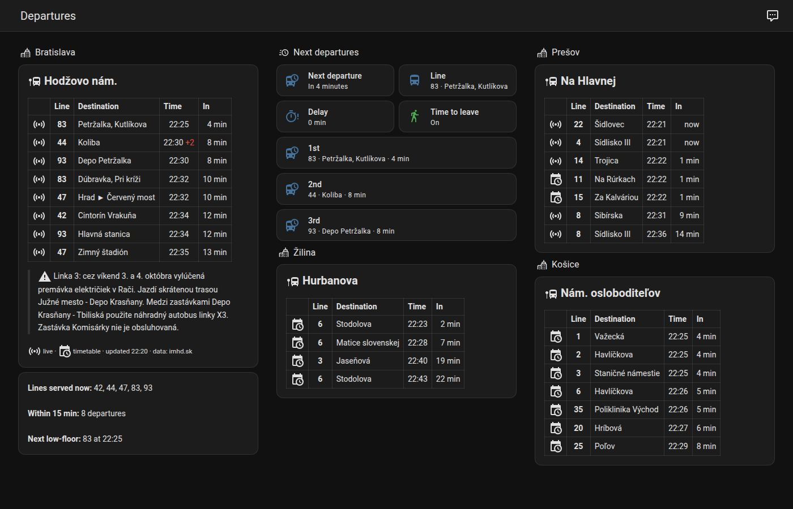

Public-transport departures from [imhd.sk](https://imhd.sk/) in Home Assistant,
for every city and region imhd.sk covers: Bratislava, Košice, Žilina, Banská
Bystrica, Prešov, Nitra and more. Pick a stop and you get a template-friendly
departures sensor, the next line and its delay, a "time to leave" sensor that
accounts for your walk to the stop, and imhd.sk service alerts. The data is
**pushed** by imhd.sk's own live feed. You don't need an add-on, an MQTT broker,
a scraper or a browser.

> [!IMPORTANT]
> This is an **unofficial** community project, not affiliated with imhd.sk.
> imhd.sk's terms allow its data to be used for **personal purposes only**
> unless imhd.sk agrees otherwise. Don't use this integration commercially or
> to redistribute the data, and keep the number of configured stops reasonable.
> See [Disclaimer & fair use](#disclaimer--fair-use).

## Contents

- [Features](#features)
- [How it works](#how-it-works)
- [Requirements](#requirements)
- [Installation](#installation)
- [Configuration](#configuration)
- [Finding your stop](#finding-your-stop)
- [Supported cities](#supported-cities)
- [Entities](#entities)
- [The main sensor and its attributes](#the-main-sensor-and-its-attributes)
- [Templating quick start](#templating-quick-start)
- [Templating guide](#templating-guide)
- [Dashboard examples](#dashboard-examples)
- [Automations](#automations)
- [Actions reference](#actions-reference)
- [openHASP display](#openhasp-display)
- [Troubleshooting and FAQ](#troubleshooting-and-faq)
- [Migrating from an old pyscript / MQTT setup](#migrating-from-an-old-pyscript--mqtt-setup)
- [Disclaimer & fair use](#disclaimer--fair-use)
- [Contributing](#contributing)
- [License](#license)

## Features

- **Push updates** over the socket.io feed that imhd.sk's own online departure
  boards use. There is no polling and no HTML scraping of departures.
- **All imhd.sk sections**: 21 cities and regions plus the country-wide
  *Slovensko a svet* section. See [Supported cities](#supported-cities).
- **Realtime where imhd.sk tracks vehicles.** Vehicle-tracked departures come with
  a delay, the vehicle and its position. They were seen in **Bratislava** and
  **Prešov**. In the other cities imhd.sk published timetable departures, which
  the integration shows marked as such (`realtime: false`, `~` in the board text).
- **Detailed departures:** expected and scheduled time, delay, platform, headsign
  and terminal stop, vehicle number and model, low floor and air conditioning,
  the stop the vehicle last passed and how many stops away it is, a "stuck"
  flag, and the countdown text the imhd.sk board shows.
- **Walking time and "time to leave":** departures you can't catch any more are
  hidden, every departure has a `leave_in` value, and a binary sensor turns on
  when it's time to go.
- **Service alerts:** imhd.sk info texts (diversions, outages) as a binary
  sensor with the messages.
- **Filters per stop:** platforms, lines, excluded lines, direction (case and
  diacritics are ignored) and the number of departures.
- **A main sensor for templates** with the whole list, plus `Departure 1` …
  `Departure N` sensors for tiles. Entity ids don't depend on the Home
  Assistant language.
- **Response actions:** `imhd.get_departures` and `imhd.find_stops` return data
  for scripts and automations, and `imhd.refresh` reconnects.
- **Careful connection handling:** reconnects with back-off, waits a long time
  when imhd.sk refuses connections, and shows repair issues and diagnostics.
- **UI or YAML configuration.** Find a stop by name, nearest to your home,
  nearest to a point on a map, by stop ID or from a pasted imhd.sk link.
- **English and Slovak** translations.
- **Ready-made [examples](examples/):** dashboards, template sensors,
  automations, a notification [blueprint](#time-to-leave-notification-blueprint)
  and an [openHASP](#openhasp-display) departure board.

## How it works

When a stop is set up, the integration reads the stop's name, city and platforms
from its imhd.sk board page. It reads them again after a restart, a reload or
`imhd.refresh`. It then opens **one** socket.io connection for the stop and
subscribes to the stop's departure board, like an open imhd.sk board in a
browser. imhd.sk pushes the departures of each platform, the details of the
vehicles on the board and the stop's info texts.

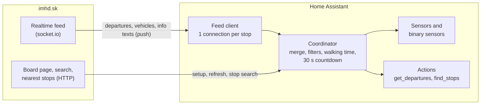

Behaviour in detail:

- **Partial updates are merged.** imhd.sk re-sends only the platforms that
  changed, and the integration keeps the latest data of every platform.
- **Countdowns keep running.** Every 30 seconds `minutes`, `leave_in` and the
  board `text` are recomputed from the expected departure time.
- **Departed rows disappear.** Once the expected time is reached, a
  departure's text is `*` and `minutes` is 0. It is dropped as soon as the
  expected time is more than 30 seconds in the past.
- **Quiet stops are not errors.** At night or in small towns imhd.sk may send
  nothing at all. If no departures arrive within about 6 seconds of
  connecting, the stop counts as empty: the main sensor is `unknown`,
  `departure_count` is 0, and the entities stay available.
- **Connection drops are absorbed.** The integration reconnects after 2 s,
  backing off up to 60 s. The entities keep the last data, with running
  countdowns, and become unavailable only after **300 s** without a
  connection. If a stop with departures gets no new departure data for 15
  minutes, the integration reconnects.
- **Refused connections wait.** imhd.sk can refuse a connection with code −10
  (too many users), −11 (too many connections) or −12 (too many connections
  from your IP address). The integration then waits **15 minutes**, doubling
  the wait up to **60 minutes** between attempts, and creates a repair issue.
  The stop's entities are unavailable meanwhile. `imhd.refresh` retries at once.
- **Startup doesn't block.** Setup waits up to 15 seconds for the first data and
  continues in the background. If imhd.sk is unreachable, the stop starts from
  the details saved when it was added and connects when imhd.sk is back.

## Requirements

- Home Assistant **2025.2.0** or newer.
- [HACS](https://hacs.xyz/) for the recommended installation (optional).
- Outbound internet access from Home Assistant to `https://imhd.sk` (HTTPS and
  WebSocket). No account or API key is needed.
- The Python dependency (`python-socketio`) is installed automatically.

## Installation

### HACS (recommended)

The integration is installed as a HACS *custom repository*.

1. Make sure [HACS](https://hacs.xyz/docs/use/) is installed.
2. Click the button below and confirm, **or** add the repository manually:

   [](https://my.home-assistant.io/redirect/hacs_repository/?owner=jakubfabrici&repository=ha-imhd&category=integration)

   To add it manually, open **HACS** → **⋮** (top right) → **Custom repositories**, enter
   `https://github.com/jakubfabrici/ha-imhd`, choose the type **Integration** and
   click **Add**.
3. Search HACS for **IMHD.sk Departures**, open it and click **Download**.
4. **Restart Home Assistant.**
5. Add your stops in the [UI](#option-b-ui-config-flow) or in
   [YAML](#option-a-yaml-file).

Updates then show up in HACS like those of any other integration.

### Manual

1. Download the latest release from
   [Releases](https://github.com/jakubfabrici/ha-imhd/releases) (or clone the
   repository).
2. Copy the folder `custom_components/imhd` into your Home Assistant
   configuration directory, so that you end up with
   `<config>/custom_components/imhd/manifest.json`.
3. Restart Home Assistant and add your stops.

## Configuration

Every configured stop becomes one **device** with its own entities. You can use
both ways of configuring stops at the same time.

### Option A: YAML file

Put your stops in a separate file and include it from `configuration.yaml`:

```yaml
# configuration.yaml
imhd: !include imhd.yaml
```

```yaml
# imhd.yaml - one list item per stop
- name: Hodzovo                 # device name; entity ids: sensor.hodzovo_departures, ...
  city: ba                      # section code (ba, ke, za, ...) or city name ("Bratislava")
  stop: 83                      # stop id, exact stop name or imhd.sk link
  platforms: ["*"]              # platform labels or ids; "*" or empty = all (default)
  lines: []                     # only these lines (default: all)
  exclude_lines: ["►"]          # never these lines; "►" = unnumbered service trips
  direction: []                 # headsign or terminal must contain one of these texts
  max_departures: 10            # 1..30, size of the departures list
  walking_time: 3               # 0..120 minutes to walk to the stop
  time_to_leave_window: 2       # 0..60, "Time to leave" is on while 0 <= leave_in <= this
  departure_sensors: 3          # 0..10 extra "Departure N" sensors

- name: Hurbanova
  city: za
  stop: "https://imhd.sk/za/online-zastavkova-tabula?st=1831"
  direction: ["Stodolova", "Jaseňová"]
  exclude_lines: ["50"]
```

A longer annotated example with three cities is in
[`examples/imhd.yaml`](examples/imhd.yaml).

| Option | Type | Default | Description |
|---|---|---|---|
| `name` | string | stop name | Name of the device. Entity ids are built from it: `Hodzovo` → `sensor.hodzovo_departures`. |
| `city` | string | **required** | imhd.sk section code (`ba`, `ke`, `za`, …) or city name (`Košice`, `kosice`). Case and diacritics are ignored. See [Supported cities](#supported-cities). |
| `stop` | int / string | **required** | Stop ID, exact stop name or imhd.sk link. See [The `stop` value](#the-stop-value). |
| `platforms` | list or comma-separated string | all | Only departures from these platforms: labels as shown on imhd.sk (`A`, `B`, …) or platform ids (`2474`). `"*"` means all. |
| `lines` | list or comma-separated string | all | Only these lines. Exact match, case-insensitive. Quote numbers: `["9", "X13"]`. |
| `exclude_lines` | list or comma-separated string | none | Never show these lines. `"►"` hides unnumbered service trips such as depot runs. |
| `direction` | string or list | all | Only departures whose headsign (`destination`) or terminal stop (`terminal`) contains one of these texts. Case and diacritics are ignored (`petrzalka` matches `Petržalka`). A single string is one text, and commas in it are kept. |
| `max_departures` | int, 1–30 | `10` | How many departures the main sensor lists. |
| `walking_time` | int, 0–120 min | `0` | Time you need to reach the stop. When it is above 0, departures you can't catch any more (`leave_in < 0`) are hidden. |
| `time_to_leave_window` | int, 0–60 min | `2` | **Time to leave** is on while `0 ≤ leave_in ≤ window` for the next catchable departure. |
| `departure_sensors` | int, 0–10 | `3` | Number of `Departure 1` … `Departure N` sensors. |

#### The `stop` value

| You write | Example | How it is resolved |
|---|---|---|
| Stop ID | `83` or `"83"` | Used as is. |
| Board link | `https://imhd.sk/ba/online-zastavkova-tabula?st=83` | The number after `st=`. With `st=83;84`, the first id is used. |
| Stop page link | `https://imhd.sk/ba/zastavka/Hodžovo-nám/ca71b6718971878271cc` | The stop id is encoded in the last part of the link. imhd.sk search results and timetables link to these pages. |
| Exact stop name | `Hodžovo nám.` or `hodzovo nam.` | Looked up with the imhd.sk search of `city`. The name must match a stop name exactly, ignoring case and diacritics. Partial names fail, so use the config flow or [`imhd.find_stops`](#imhdfind_stops) to search. |

The city in a link wins over `city`. A stop that imhd.sk doesn't know is
logged as an error and isn't imported.

#### How YAML stops behave

- On every start of Home Assistant, each list item is imported into a regular
  config entry, so YAML stops show up under **Settings → Devices & services**
  as well.
- A stop is identified by its city, stop ID and `name`. To change the filters
  or numbers of a YAML stop, edit `imhd.yaml` and restart: the existing entry is
  updated and reloaded. YAML wins, so changes made with **Configure** in the UI
  are overwritten on the next restart.
- Changing `name`, `stop` or `city` creates a **new** entry, with new entity
  ids. The old entry gets a repair issue.
- If you remove a stop from YAML, a repair issue suggests deleting its entry.
  The entry keeps working until you delete it.
- You can configure the same stop more than once with different names and
  filters, for example one device per platform or per direction.

### Option B: UI (config flow)

[](https://my.home-assistant.io/redirect/config_flow_start/?domain=imhd)

You can also go to **Settings → Devices & services → Add integration** and
search for **IMHD.sk Departures**.

1. **City and method.** Pick the city and how to find the stop: *Nearest to my
   home location*, *Nearest to a point on the map*, *Search by name* or
   *Stop ID or imhd.sk URL*. See [Finding your stop](#finding-your-stop).

   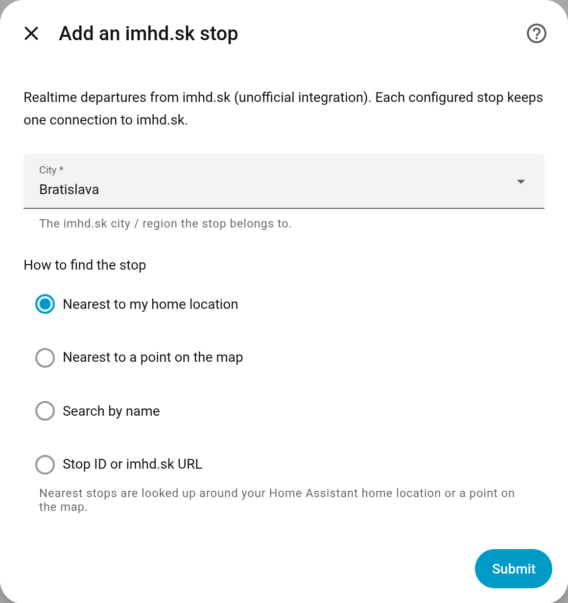

2. **Pick the stop.** Choose from the list. It shows the name and city, and for
   nearby stops the platforms and the distance. If you entered a stop ID or
   link, this step is skipped.

   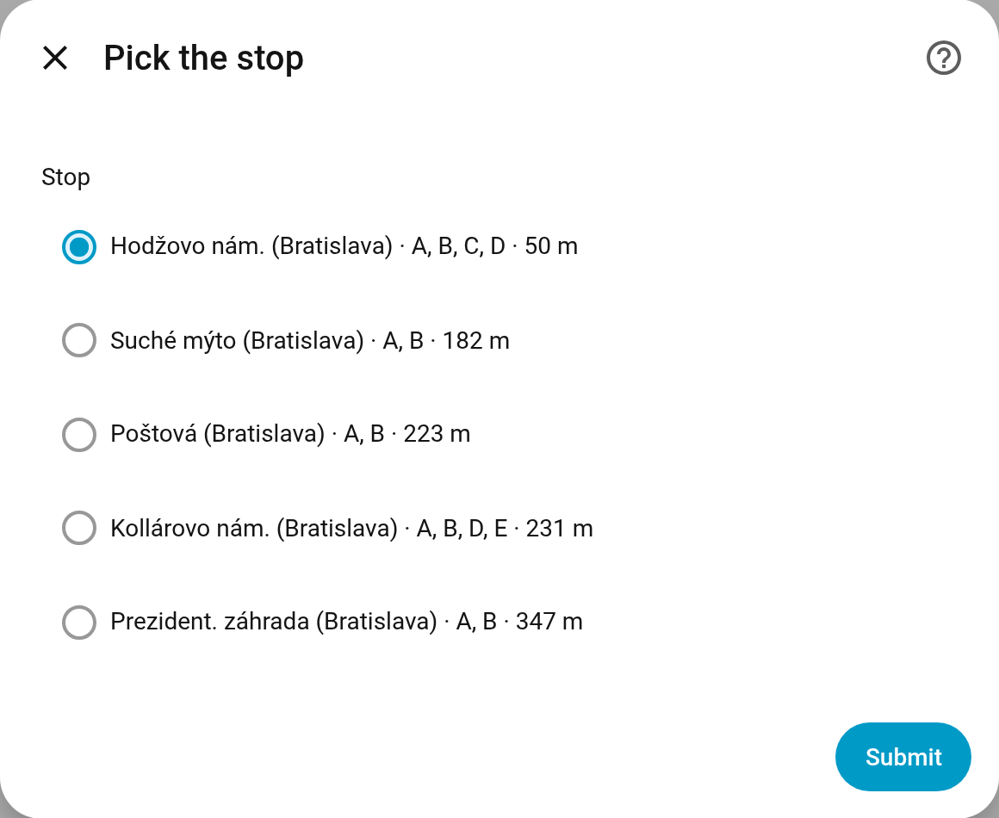

3. **Settings.** Set the name, platforms, lines, excluded lines, direction,
   number of departures, walking time, time-to-leave window and the number of
   per-departure sensors. These are the same options as in YAML. The form
   links to the stop's imhd.sk board so you can compare.

   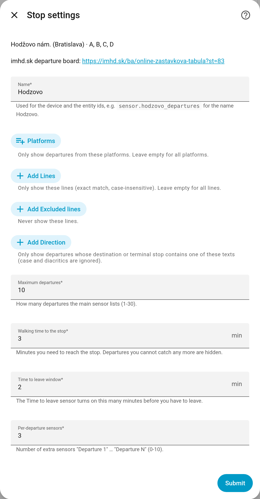

Afterwards you can:

- change the filters with **Configure** on the stop's entry, and
- move the entry to another stop with **⋮ → Reconfigure**. The name, the other
  filters and the entity ids are kept. The platform filter is cleared, because
  platforms belong to a stop.

## Finding your stop

Pick whichever of these suits you:

| Method | In the UI | In YAML (`stop:`) | With an action |
|---|---|---|---|
| Name search (imhd.sk search: partial words, accents optional) | *Search by name* | Exact name only | `imhd.find_stops` with `query` |
| Nearest to your home | *Nearest to my home location* (5 nearest stops) | – | `imhd.find_stops` without `query` |
| Nearest to a point | *Nearest to a point on the map* | – | `imhd.find_stops` with `latitude` / `longitude` |
| Stop ID | *Stop ID or imhd.sk URL* | `83` | – |
| Pasted link (`?st=` board link or `/zastavka/…` stop page) | *Stop ID or imhd.sk URL* | the link | – |

To find the ID on imhd.sk, open the online departure board of your city, for
example <https://imhd.sk/ba/online-zastavkova-tabula> (*Online zastávková
tabuľa*), choose your stop and look at the address bar:
`https://imhd.sk/ba/online-zastavkova-tabula?st=83`. The number after `st=` is
the stop ID. You can also paste the whole link.

To search from **Developer tools → Actions**:

```yaml
action: imhd.find_stops
data:
  city: ba
  query: Hodžovo
```

Leave out `query` to get the five stops nearest to your home, or to `latitude` /
`longitude`. See [`imhd.find_stops`](#imhdfind_stops).

Stops used in this documentation:

| City | Stop | ID | Platforms |
|---|---|---|---|
| Bratislava (`ba`) | Hodžovo nám. | `83` | `A`, `B`, `C`, `D` (vehicle-tracked) |
| Košice (`ke`) | Nám. osloboditeľov | `1130` | 10 unlabeled platforms, `2474` … `2483` |
| Žilina (`za`) | Hurbanova | `1831` | 2 unlabeled platforms, `3439` and `3440` |

## Supported cities

`city` accepts the section code or the city name. Case and diacritics are
ignored, and *Poprad-Tatry* also matches `poprad` or `tatry`.

| Code | City / region | Code | City / region |
|---|---|---|---|
| `ba` | Bratislava | `pn` | Piešťany |
| `bb` | Banská Bystrica | `po` | Prešov |
| `hc` | Hlohovec | `rk` | Ružomberok |
| `ke` | Košice | `se` | Senica |
| `lm` | Liptovský Mikuláš | `si` | Skalica |
| `mt` | Martin | `sn` | Spišská Nová Ves |
| `nr` | Nitra | `tatry` | Poprad-Tatry |
| `nz` | Nové Zámky | `tn` | Trenčín |
| `pb` | Považská Bystrica | `tt` | Trnava |
| `pd` | Prievidza | `za` | Žilina |
| `transport` | Slovensko a svet (country-wide) | `zv` | Zvolen |

**Realtime or timetable?** The integration shows what the imhd.sk board shows.
Departures that imhd.sk ties to a tracked vehicle have `realtime: true`, a
`delay`, a `vehicle` and usually its position (`previous_stop`, `stops_away`).
When this documentation was written, such departures were seen only in
**Bratislava** and **Prešov**. Even there, some regional lines and trips without
an assigned vehicle are timetable-only. The other cities showed timetable data
only: `realtime: false`, `delay: null` and `~` in front of the board `text`.
Everything else works the same, and if imhd.sk adds vehicle tracking for a
city, it shows up without an update.

Many cities have no platform labels. There, `platform` holds the numeric
platform id, for example `2474` in Košice.

## Entities

Each stop is a device with these entities. Entity ids are
`<domain>.<name>_<key>`, where `<name>` is the stop's `name` as a slug:
lowercase, without diacritics, with other characters replaced by `_`. A stop named
**Hodzovo** gets the ids below, `Hodžovo nám.` gives `hodzovo_nam` and
`Nám. osloboditeľov` gives `nam_osloboditelov`. **Entity ids don't depend on
the Home Assistant language.** Only the display names are translated, so
templates work everywhere.

| Entity id | Display name (en / sk) | State | Attributes |
|---|---|---|---|
| `sensor.hodzovo_departures` | Departures / Odchody | Minutes until the next departure (`min`), or `unknown` when there is none | The full departure list and summary fields, see [below](#the-main-sensor-and-its-attributes) |
| `sensor.hodzovo_next_departure` | Next departure / Najbližší odchod | Timestamp of the next departure (shown as "in 4 minutes") | `line`, `destination`, `time`, `departure`, `minutes`, `delay`, `platform` |
| `sensor.hodzovo_next_line` | Next line / Najbližšia linka | Line of the next departure, for example `44` | same as above |
| `sensor.hodzovo_delay` | Delay / Meškanie | Delay of the next departure in minutes, or `unknown` when it isn't vehicle-tracked | same as above |
| `sensor.hodzovo_departure_1` … `_N` | Departure 1 … N / Odchod 1 … N | Minutes until the N-th departure | All [departure fields](#departure-fields) of that departure (none when there is no N-th departure). N = `departure_sensors`. |
| `binary_sensor.hodzovo_time_to_leave` | Time to leave / Čas vyraziť | `on` while `0 ≤ leave_in ≤ time_to_leave_window` for the next catchable departure | `line`, `destination`, `departure`, `leave_in` |
| `binary_sensor.hodzovo_realtime_connected` | Realtime connection / Spojenie v reálnom čase | `on` while connected to the imhd.sk feed (*connectivity*, diagnostic) | `last_message`, `reconnects` |
| `binary_sensor.hodzovo_disruption` | Service alert / Mimoriadnosť | `on` while imhd.sk publishes info texts for the stop (*problem*) | `messages` |

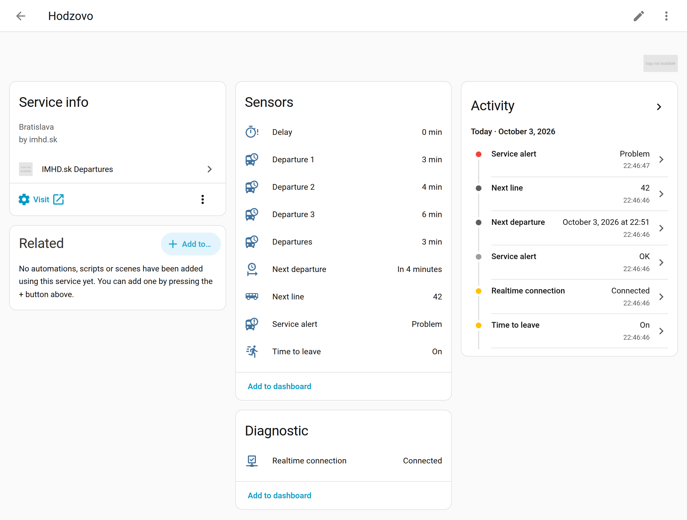

- If an id is already taken, Home Assistant appends `_2`. Ids you renamed in the
  UI are kept.
- Lowering `departure_sensors` removes the surplus `Departure N` sensors.
- All entities carry the attribution "Data: imhd.sk".
- Entities are **unavailable** before the first data arrives, while imhd.sk
  refuses the connection, and after 300 s without a connection. *Realtime
  connection* is always available, because it reports the connection itself.
- `last_message` is when imhd.sk last sent departures. `reconnects` counts the
  reconnections since the stop was loaded.
- Info texts were seen only for Bratislava stops. They appear to be dispatch
  messages of the Bratislava transport company (DPB). A message that imhd.sk
  sends in Slovak and English becomes one message with one language per line.

## The main sensor and its attributes

`sensor.hodzovo_departures` is designed for templates. Its state is the number
of whole minutes until the next departure, and its attributes contain
everything else. You can see them in **Developer tools → States**:

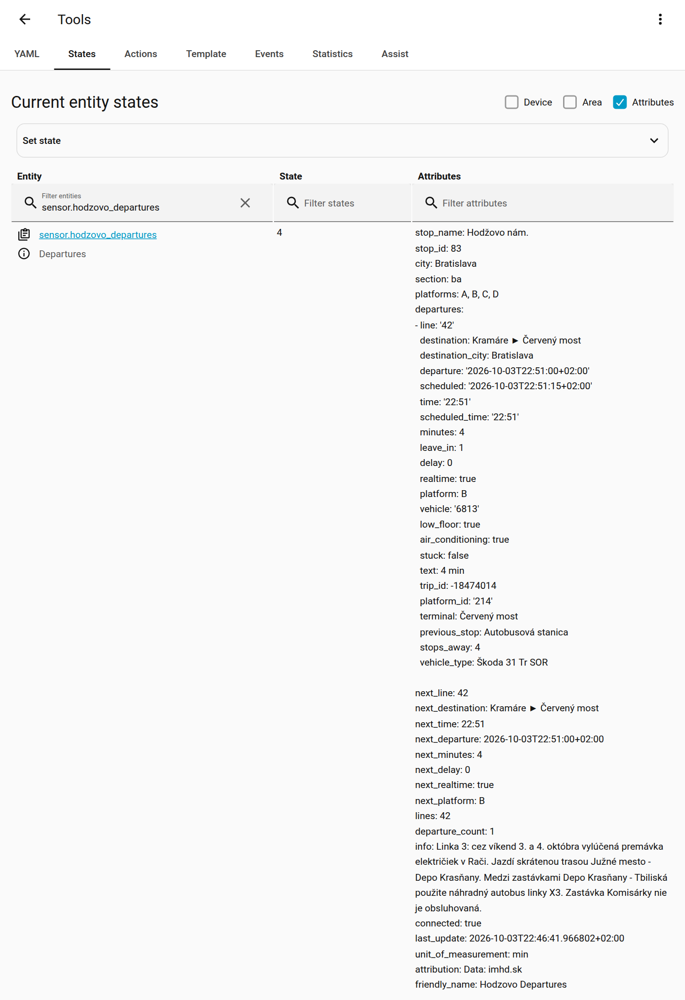

The rest of this documentation uses this example: *Hodžovo nám.* at 07:58 on a
Monday, with `walking_time: 3`. The attributes are:

```yaml
stop_name: Hodžovo nám.
stop_id: 83
city: Bratislava
section: ba
platforms: [A, B, C, D]
departures:
  - line: "44"
    destination: Koliba
    destination_city: Bratislava
    departure: "2026-10-05T08:02:10+02:00"
    scheduled: "2026-10-05T08:00:45+02:00"
    time: "08:02"
    scheduled_time: "08:01"
    minutes: 4
    leave_in: 1
    delay: 1
    realtime: true
    platform: A
    vehicle: "6127"
    low_floor: true
    air_conditioning: true
    stuck: false
    text: 4 min
    trip_id: -18185607
    platform_id: "213"
    terminal: Koliba
    previous_stop: Kozia
    stops_away: 1
    vehicle_type: SOR TNS 12
  - line: "42"
    destination: Cintorín Vrakuňa
    # ... time 08:04, minutes 5, leave_in 2, delay 0, platform A, vehicle 6813
  - line: "47"
    destination: Hrad ► Červený most   # headsign with a "via" stop
    terminal: Červený most
    # ... time 08:08, scheduled_time 08:05, minutes 10, delay 3, platform B
  - line: "44"
    destination: Koliba
    destination_city: Bratislava
    departure: "2026-10-05T08:11:00+02:00"
    scheduled: "2026-10-05T08:11:00+02:00"
    time: "08:11"
    scheduled_time: "08:11"
    minutes: 13
    leave_in: 10
    delay: null              # timetable-only departure
    realtime: false
    platform: A
    vehicle: null
    low_floor: null          # unknown
    air_conditioning: null
    stuck: false
    text: ~13 min            # "~" = timetable only
    trip_id: -18185621
    platform_id: "213"
    terminal: Koliba
    previous_stop: null
    stops_away: null
    vehicle_type: null
  - line: "42"
    destination: Cintorín Vrakuňa
    # ... time 08:19, minutes 20, delay 0, realtime true, vehicle assigned
    #     but not on its way yet (previous_stop and stops_away null)
  - line: "44"
    destination: Koliba
    # ... time 08:23, minutes 25, timetable only (text ~25 min)
next_line: "44"
next_destination: Koliba
next_time: "08:02"
next_departure: "2026-10-05T08:02:10+02:00"
next_minutes: 4
next_delay: 1
next_realtime: true
next_platform: A
lines: ["42", "44", "47"]
departure_count: 6
info: []
connected: true
last_update: "2026-10-05T07:57:48+02:00"
attribution: "Data: imhd.sk"
unit_of_measurement: min
friendly_name: Hodzovo Departures
```

`binary_sensor.hodzovo_time_to_leave` is `on` here, because the 44 at 08:02 has
`leave_in: 1` and `time_to_leave_window` is 2.

### Attributes

| Attribute | Type | Description |
|---|---|---|
| `stop_name`, `stop_id` | string, int | Stop name as shown on imhd.sk, and its ID. |
| `city`, `section` | string | City of the stop and the imhd.sk section code. |
| `platforms` | list of strings | Platforms covered: your platform filter as entered, or all platforms of the stop. |
| `departures` | list | Up to `max_departures` departures that pass the filters and walking time, sorted by expected departure. See [Departure fields](#departure-fields). |
| `next_line`, `next_destination`, `next_time`, `next_departure`, `next_minutes`, `next_delay`, `next_realtime`, `next_platform` | various | Shortcuts for the first departure (`line`, `destination`, `time`, `departure`, `minutes`, `delay`, `realtime`, `platform`). All `null` when there is none. |
| `lines` | list of strings | Unique lines in `departures`, sorted with numbers in numeric order. |
| `departure_count` | int | Number of items in `departures`. |
| `info` | list of strings | Current imhd.sk info and service-alert texts. |
| `connected` | bool | Whether the realtime feed is connected. |
| `last_update` | ISO timestamp / null | When imhd.sk last sent departures for the stop. |

`departures` and `info` aren't saved in the recorder (history database), which
keeps it small. They are always in the current state.

### Departure fields

Each item of `departures` has these keys. So do the attributes of the
`Departure N` sensors and the items in the `imhd.get_departures` response.

| Key | Type | Example | Description |
|---|---|---|---|
| `line` | string | `"44"` | Line, always a string (`"9"`, `"X13"`, `"N53"`). `"►"` is an unnumbered service trip, such as a depot run. |
| `destination` | string | `Hrad ► Červený most` | Headsign as shown on the vehicle. It can include a "via" stop after `►`. Falls back to the terminal stop. |
| `destination_city` | string / null | `Bratislava` | Town of the terminal stop. |
| `departure` | ISO timestamp | `2026-10-05T08:02:10+02:00` | Expected departure, in Home Assistant's time zone, to the second. For vehicle-tracked departures this is imhd.sk's prediction. Otherwise it is the scheduled time. |
| `scheduled` | ISO timestamp / null | `2026-10-05T08:00:45+02:00` | Scheduled (timetable) departure. |
| `time` | `HH:MM` | `08:02` | `departure` **rounded to the nearest minute**. |
| `scheduled_time` | `HH:MM` / null | `08:01` | `scheduled` rounded to the nearest minute. |
| `minutes` | int ≥ 0 | `4` | Whole minutes until `departure`, **rounded down** like on the imhd.sk board. Recomputed every 30 s. |
| `leave_in` | int | `1` | `minutes - walking_time`: minutes until you have to leave. Departures with a negative value are hidden when `walking_time` is above 0. |
| `delay` | int / null | `1` | imhd.sk's delay in whole minutes. Positive is late, negative is early, 0 is on time. `null` when the departure isn't vehicle-tracked. |
| `realtime` | bool | `true` | `true` when imhd.sk ties the departure to a tracked vehicle, including a vehicle that is assigned but hasn't started the trip yet. `false` for timetable-only departures. |
| `platform` | string | `A` | Platform label. Falls back to the platform id when the stop has no labels (`2474`). |
| `platform_id` | string / null | `"213"` | imhd.sk platform id. |
| `vehicle` | string / null | `"6127"` | Vehicle number, for vehicle-tracked departures only. |
| `vehicle_type` | string / null | `SOR TNS 12` | Vehicle model, once imhd.sk has sent the vehicle details. |
| `low_floor` | bool / null | `true` | Low-floor vehicle. `null` when unknown, which includes every timetable-only departure. |
| `air_conditioning` | bool / null | `true` | Air-conditioned vehicle. `null` when unknown. |
| `stuck` | bool | `false` | imhd.sk flags the trip as stuck. |
| `text` | string | `4 min` | Countdown text as on the imhd.sk board, recomputed locally. See the table below. |
| `trip_id` | int / null | `-18185607` | imhd.sk trip id. It is stable for one trip and can be negative (all Bratislava DPB trips are). Use it only as an identifier. |
| `terminal` | string / null | `Červený most` | Terminal stop of the trip. Regional terminals include the town (`Senec, Žel. stanica`). |
| `previous_stop` | string / null | `Kozia` | Stop the vehicle has passed last. `null` before the vehicle is on its way, and for timetable-only departures. |
| `stops_away` | int / null | `1` | Number of stops between the vehicle and this stop. 1 means the vehicle is at, or just leaving, the previous stop. `null` when `previous_stop` is `null`. |

The `text` field:

| `text` | Meaning |
|---|---|
| `*` | Departing now. The expected time has been reached, and the row is dropped once it is more than 30 s in the past. |
| `<1 min` | Less than a minute to go. |
| `4 min` | Whole minutes, from 1 to 60. |
| `22:15` | More than 60 minutes ahead (rounded to the nearest minute). |
| `~` in front | Timetable-only departure (`realtime: false`), for example `~13 min` or `~23:10`. `*` never gets a `~`. |

## Templating quick start

The three templates you will want most often (try them in **Developer tools →
Template**):

| What | Template | Output |
|---|---|---|
| Next departure | `{{ state_attr('sensor.hodzovo_departures', 'next_line') }} → {{ state_attr('sensor.hodzovo_departures', 'next_destination') }} at {{ state_attr('sensor.hodzovo_departures', 'next_time') }}` | `44 → Koliba at 08:02` |
| Next three, board style | `{{ d.line }} {{ d.text }}{{ ', ' if not loop.last }}` | `44 4 min, 42 5 min, 47 10 min` |
| Times of line 44 | `{{ (state_attr('sensor.hodzovo_departures', 'departures') or []) \| selectattr('line', 'eq', '44') \| map(attribute='time') \| join(', ') }}` | `08:02, 08:11, 08:23` |

The [templating guide](#templating-guide) below has many more, and the
[cookbook](examples/templates/README.md) explains them step by step.

## Templating guide

All examples read `sensor.hodzovo_departures` and show their output for the data
[above](#the-main-sensor-and-its-attributes). Try them in **Developer tools →
Template**.

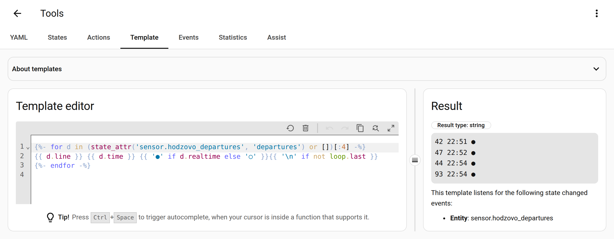

A few rules of thumb:

- Read the list with `state_attr('sensor.hodzovo_departures', 'departures') or []`.
  The `or []` keeps templates working while the sensor is unavailable.
- `line` is always a string: compare it with `'44'`, not `44`.
- `minutes`, `leave_in` and `text` are refreshed every 30 seconds, so templates
  that use them update on their own. You don't need `now()` or a time-pattern
  trigger.
- `delay`, `low_floor`, `vehicle` and the like can be `null`. Test them with
  `is none` before comparing.
- More examples, explained step by step: [`examples/templates/`](examples/templates/README.md).

**1. Next departure as a sentence**

```jinja


Line {{ state_attr(s, 'next_line') }} to {{ state_attr(s, 'next_destination') }} leaves at {{ state_attr(s, 'next_time') }} (in {{ states(s) }} min).

No departures at the moment.

```

Output: `Line 44 to Koliba leaves at 08:02 (in 4 min).`

**2. Minutes, with "now" for 0**

```jinja

 –
 now
 {{ m }} min

```

Output: `4 min` (and `now` when the bus is at the stop).

The same idea as a macro for every departure:

```jinja
{{ 'now' if m == 0 else m ~ ' min' }}

{{ d.line }}: {{ eta(d.minutes) }}{{ ', ' if not loop.last }}

```

Output: `44: 4 min, 42: 5 min, 47: 10 min`

**3. Next three departures of one line**

```jinja

{{ (deps | selectattr('line', 'eq', '44') | map(attribute='time') | list)[:3] | join(', ') }}
```

Output: `08:02, 08:11, 08:23`

**4. Departures in one direction**

```jinja


{{ d.line }} at {{ d.time }}{{ ', ' if not loop.last }}

```

Output: `42 at 08:04, 42 at 08:19` (the `true` makes the match case-insensitive).

**5. Markdown table**

```jinja
| Line | Destination | Departs | Live |
|:---:|:---|---:|:---:|

| **{{ d.line }}** | {{ d.destination }} | {{ 'now' if d.minutes == 0 else d.minutes ~ ' min' if d.minutes < 60 else d.time }} | {{ '●' if d.realtime else '' }} |

```

Output:

| Line | Destination | Departs | Live |
|:---:|:---|---:|:---:|
| **44** | Koliba | 4 min | ● |
| **42** | Cintorín Vrakuňa | 5 min | ● |
| **47** | Hrad ► Červený most | 10 min | ● |
| **44** | Koliba | 13 min |  |
| **42** | Cintorín Vrakuňa | 20 min | ● |
| **44** | Koliba | 25 min |  |

**6. Delay as text**

```jinja

 timetable only
 {{ d }} min late
 {{ d | abs }} min early
 on time

```

Output: `1 min late`

**7. Realtime marker**

```jinja

{{ d.line }} {{ d.time }} {{ '●' if d.realtime else '○' }}{{ '\n' if not loop.last }}

```

Output:

```text
44 08:02 ●
42 08:04 ●
47 08:08 ●
44 08:11 ○
```

**8. When do I have to leave?**

```jinja



 Leave now for the {{ d.line }}!
 Leave in {{ d.leave_in }} min for the {{ d.line }} at {{ d.time }}.

 Nothing to catch right now.

```

Output: `Leave in 1 min for the 44 at 08:02.`

**9. Number of departures in the next 15 minutes**

```jinja
{{ (state_attr('sensor.hodzovo_departures', 'departures') or [])
   | selectattr('minutes', 'le', 15) | list | count }}
```

Output: `4`

**10. Where is the vehicle?**

```jinja


{{ d.line }} (#{{ d.vehicle }}) is {{ d.stops_away }} stop{{ 's' if d.stops_away != 1 }} away, last seen at {{ d.previous_stop }}.
 No vehicle on its way.

```

Output: `44 (#6127) is 1 stop away, last seen at Kozia.`

**11. First low-floor departure**

```jinja

{{ 'Line ' ~ d.line ~ ' at ' ~ d.time if d is defined else 'No low-floor departure known' }}
```

Output: `Line 44 at 08:02`. Timetable-only departures (`low_floor: null`) are
skipped.

**12. Grouped by platform**

```jinja

Platform {{ p.grouper }}: {{ d.line }} {{ d.time }}{{ ', ' if not loop.last }}{{ '\n' if not loop.last }}

```

Output:

```text
Platform A: 44 08:02, 42 08:04, 44 08:11, 42 08:19, 44 08:23
Platform B: 47 08:08
```

**13. Slovak sentence (with the correct plural)**

```jinja


 Momentálne nič nepremáva.


Linka {{ state_attr(s, 'next_line') }} smer {{ state_attr(s, 'next_destination') }} odchádza
{{- ' teraz' if m == 0 else ' o ' ~ m ~ ' ' ~ jednotka }} ({{ state_attr(s, 'next_time') }}).

```

Output: `Linka 44 smer Koliba odchádza o 4 minúty (08:02).`

**14. TTS-friendly sentence**

```jinja

{{ n }} {{ 'minute' if n == 1 else 'minutes' }}

There are no departures from {{ state_attr('sensor.hodzovo_departures', 'stop_name') }} right now.


The next {{ a.line }} to {{ a.destination }} {{ 'is leaving now' if a.minutes == 0 else 'leaves in ' ~ mins(a.minutes) }}
, running {{ mins(a.delay) }} late.
 After that, the {{ deps[1].line }} to {{ deps[1].destination }} in {{ mins(deps[1].minutes) }}.

```

Output: `The next 44 to Koliba leaves in 4 minutes, running 1 minute late. After that, the 42 to Cintorín Vrakuňa in 5 minutes.`

**15. Exact countdown from the timestamp**

```jinja

{{ time_until(as_datetime(dep)) if dep else 'n/a' }}
```

Output: `4 minutes`

**16. Lines currently served**

```jinja
{{ (state_attr('sensor.hodzovo_departures', 'lines') or []) | join(', ') }}
```

Output: `42, 44, 47`

### Using templates in template sensors

Wrap any of the templates in a [template entity](https://www.home-assistant.io/integrations/template/)
to get its value as a sensor you can show, record or automate on:

```yaml
# configuration.yaml
template:
  - sensor:
      - name: "Hodzovo next departure text"
        unique_id: hodzovo_next_departure_text
        icon: mdi:bus-clock
        state: >
          
          
          Line {{ state_attr(s, 'next_line') }} to {{ state_attr(s, 'next_destination') }} at {{ state_attr(s, 'next_time') }}
          
          No departures
          

      - name: "Hodzovo departures within 15 min"
        unique_id: hodzovo_departures_within_15
        unit_of_measurement: departures
        state: >
          {{ (state_attr('sensor.hodzovo_departures', 'departures') or [])
             | selectattr('minutes', 'le', 15) | list | count }}

  - binary_sensor:
      - name: "Hodzovo leave for 44"
        unique_id: hodzovo_leave_for_44
        icon: mdi:walk
        state: >
          {{ (state_attr('sensor.hodzovo_departures', 'departures') or [])
             | selectattr('line', 'eq', '44')
             | selectattr('leave_in', 'ge', 0)
             | selectattr('leave_in', 'le', 2)
             | list | count > 0 }}
```

You can also create them in the UI: **Settings → Devices & services → Helpers →
Create helper → Template**. More ready-to-use template entities are in
[`examples/templates/template_sensors.yaml`](examples/templates/template_sensors.yaml).

### Using templates in a Markdown card

The [Markdown card](https://www.home-assistant.io/dashboards/markdown/) renders
templates directly and updates live:

```yaml
type: markdown
content: >
  **{{ state_attr('sensor.hodzovo_departures', 'stop_name') }}**:
  
  {{ d.line }} → {{ d.destination }} {{ 'now' if d.minutes == 0 else d.minutes ~ ' min' }}{{ ' · ' if not loop.last }}
  
```

Output: **Hodžovo nám.**: 44 → Koliba 4 min · 42 → Cintorín Vrakuňa 5 min · 47 → Hrad ► Červený most 10 min

## Dashboard examples

All examples are in [`examples/dashboards/`](examples/dashboards/). Add them with
**Edit dashboard → Add card → Manual** and paste the YAML. Everything except the
Mushroom example uses core cards only. A complete view that combines them is in
[`full_view.yaml`](examples/dashboards/full_view.yaml); paste it into a new
dashboard's raw configuration editor.

### Markdown departure board

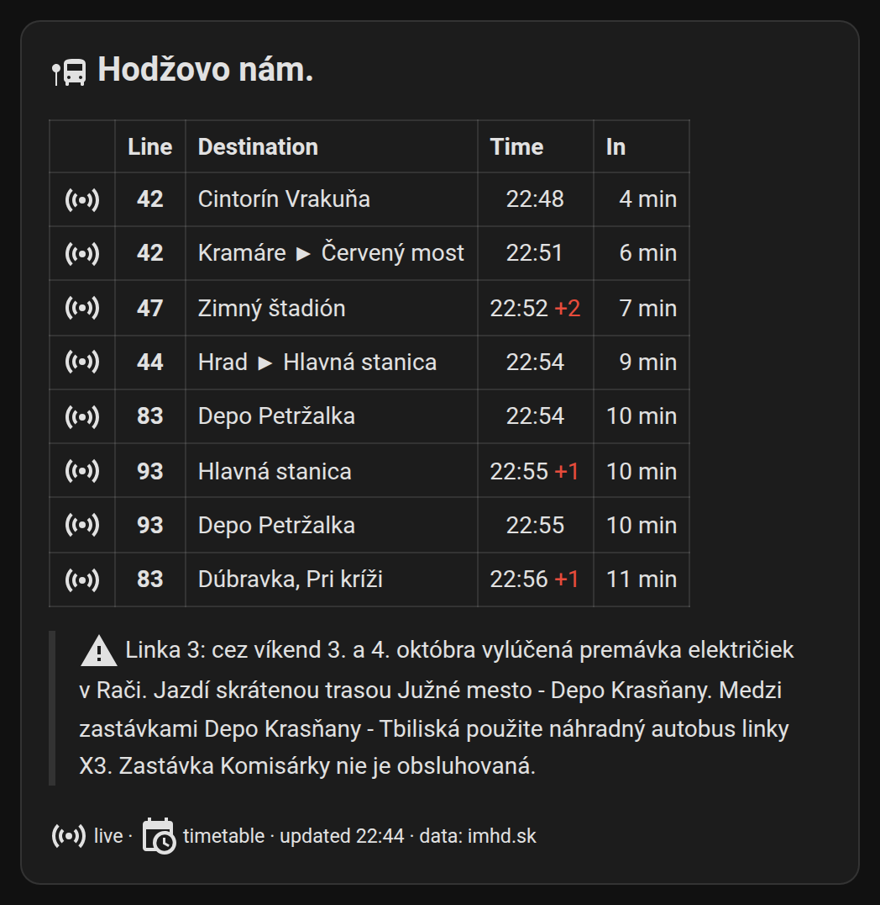

```yaml
type: markdown
content: |
  
  
  ## <ha-icon icon="mdi:bus-stop"></ha-icon> {{ state_attr(s, 'stop_name') or 'Departures' }}
  
  | | Line | Destination | Time | In |
  |:-:|:-:|:--|:-:|--:|
  
  | {{ '<ha-icon icon="mdi:access-point"></ha-icon>' if d.realtime else '<ha-icon icon="mdi:calendar-clock"></ha-icon>' }} | **{{ d.line }}** | {{ d.destination }} | {{ d.time }}{{ ' <font color="#e74c3c">+' ~ d.delay ~ '</font>' if d.delay and d.delay > 0 }} | {{ 'now' if d.minutes == 0 else d.minutes ~ ' min' if d.minutes < 60 else '' }} |
  
  
  *No departures at the moment.*
  
  
  > <ha-icon icon="mdi:alert"></ha-icon> {{ m }}
  
  <sub><ha-icon icon="mdi:access-point"></ha-icon> live · <ha-icon icon="mdi:calendar-clock"></ha-icon> timetable · updated {{ as_timestamp(state_attr(s, 'last_update'), 0) | timestamp_custom('%H:%M') if state_attr(s, 'last_update') else '–' }} · data: imhd.sk</sub>
```

### Tile cards

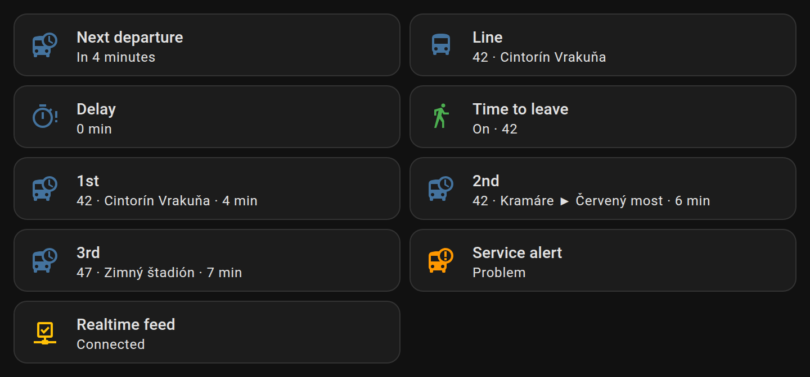

```yaml
type: grid
columns: 2
square: false
cards:
  - type: tile
    entity: sensor.hodzovo_next_departure
    name: Next departure
    icon: mdi:bus-clock
  - type: tile
    entity: sensor.hodzovo_next_line
    name: Line
    icon: mdi:bus
    state_content: [state, destination]
  - type: tile
    entity: sensor.hodzovo_delay
    name: Delay
    icon: mdi:timer-alert-outline
  - type: tile
    entity: binary_sensor.hodzovo_time_to_leave
    name: Time to leave
    icon: mdi:walk
    color: green
  - type: tile
    entity: sensor.hodzovo_departure_1
    name: "1st"
    state_content: [line, destination, state]
  - type: tile
    entity: sensor.hodzovo_departure_2
    name: "2nd"
    state_content: [line, destination, state]
```

Full version: [`tiles.yaml`](examples/dashboards/tiles.yaml).

### Entities card

```yaml
type: entities
title: Hodžovo nám.
state_color: true
entities:
  - entity: sensor.hodzovo_departures
    name: Next departure in
  - type: attribute
    entity: sensor.hodzovo_departures
    attribute: next_line
    name: Line
    icon: mdi:bus
  - type: attribute
    entity: sensor.hodzovo_departures
    attribute: next_destination
    name: Destination
    icon: mdi:sign-direction
  - entity: sensor.hodzovo_next_departure
    name: Departs at
    format: time
  - entity: sensor.hodzovo_delay
  - entity: binary_sensor.hodzovo_time_to_leave
  - entity: binary_sensor.hodzovo_disruption
  - entity: binary_sensor.hodzovo_realtime_connected
```

Full version: [`entities.yaml`](examples/dashboards/entities.yaml).

### Service alert (conditional card)

This card is visible only while imhd.sk publishes an alert for the stop:

```yaml
type: conditional
conditions:
  - condition: state
    entity: binary_sensor.hodzovo_disruption
    state: "on"
card:
  type: markdown
  content: |
    ### <ha-icon icon="mdi:alert-outline"></ha-icon> Service alert
    
    - {{ m }}
    
```

### Mushroom (optional, custom card)

With [Mushroom](https://github.com/piitaya/lovelace-mushroom) installed from
HACS, a template card can colour the next departure by urgency:

```yaml
type: custom:mushroom-template-card
entity: sensor.hodzovo_departures
primary: "{{ state_attr(entity, 'next_line') }} → {{ state_attr(entity, 'next_destination') }}"
secondary: >
  
  {{ 'now' if m == 0 else 'in ' ~ m ~ ' min' }} · {{ state_attr(entity, 'next_time') }}
icon: mdi:bus-clock
icon_color: >
  
  greyredambergreen
```

More, with status chips and one card per departure, is in [`custom_cards.yaml`](examples/dashboards/custom_cards.yaml).

## Automations

### Time-to-leave notification (blueprint)

[](https://my.home-assistant.io/redirect/blueprint_import/?blueprint_url=https://github.com/jakubfabrici/ha-imhd/blob/main/blueprints/automation/imhd/time_to_leave.yaml)

The [blueprint](blueprints/automation/imhd/time_to_leave.yaml) sends a
notification when a stop's **Time to leave** sensor turns on. Its inputs are:

- the *Time to leave* binary sensor of your stop,
- optionally, the lines to notify about (`44, 47`),
- the targets: Companion-app devices, notify entities and/or any notify action
  (`notify.family`, `notify.telegram_me`, …),
- optional conditions: people who must be home, a time window, weekdays and
  any extra conditions,
- a title and a message. The message is a template that can use the variables
  `line`, `destination`, `departure`, `departure_time`, `leave_in`, `minutes`
  and `stop`. The default message reads: *Leave in 1 min for line 44 to Koliba,
  it departs from Hodzovo at 08:02.*

Set `walking_time` (and `time_to_leave_window`) on the stop first. The sensor
turns on when `leave_in` drops into the window.

### TTS announcement

This automation announces the next departure on a speaker on weekday mornings
([`tts_announcement.yaml`](examples/automations/tts_announcement.yaml)):

```yaml
alias: "IMHD: announce time to leave"
triggers:
  - trigger: state
    entity_id: binary_sensor.hodzovo_time_to_leave
    from: "off"
    to: "on"
conditions:
  - condition: time
    after: "06:30:00"
    before: "09:00:00"
    weekday: [mon, tue, wed, thu, fri]
actions:
  - action: tts.speak
    target:
      entity_id: tts.google_translate_en_com
    data:
      media_player_entity_id: media_player.kitchen_speaker
      message: >
        
        
        The next {{ deps[0].line }} to {{ deps[0].destination }} leaves in {{ deps[0].minutes }} minutes.
        
        There are no departures right now.
        
mode: single
```

The example file uses the full sentence from template 14 of the
[templating guide](#templating-guide), with the delay, the following departure
and the singular/plural.

### Service-alert notification

This automation notifies you when imhd.sk publishes an alert for the stop. The
full example ([`disruption_notify.yaml`](examples/automations/disruption_notify.yaml))
also updates the notification when the text changes and clears it when the
alert ends. Here is the core of it:

```yaml
alias: "IMHD: service alert notification"
triggers:
  - trigger: state
    entity_id: binary_sensor.hodzovo_disruption
    to: "on"
conditions: []
actions:
  - action: notify.mobile_app_my_phone
    data:
      title: "Service alert: {{ state_attr('sensor.hodzovo_departures', 'stop_name') }}"
      message: >-
        {{ (state_attr('binary_sensor.hodzovo_disruption', 'messages') or []) | join('\n\n') }}
      data:
        tag: imhd-hodzovo-alert
        url: https://imhd.sk/ba/online-zastavkova-tabula?st=83
mode: queued
```

## Actions reference

### `imhd.get_departures`

Returns the departures of a configured stop, for scripts, voice assistants
and LLM tools. It searches every departure imhd.sk currently sends for the stop
that passes the stop's own filters and walking time, so it can return more than
`max_departures`. The countdowns are computed when the action runs.

| Field | Required | Description |
|---|---|---|
| `entity_id` | one of these two | Any IMHD entity of the stop, usually `sensor.<stop>_departures`. |
| `config_entry_id` | one of these two | The stop's config entry. |
| `line` | no | List of lines, for example `["44", "X13"]`. Exact match, case-insensitive. |
| `direction` | no | Text the headsign (`destination`) or terminal stop (`terminal`) must contain. Case and diacritics are ignored. |
| `limit` | no | Maximum number of departures, 1–30. Defaults to the stop's `max_departures`. |
| `min_minutes` | no | Skip departures leaving in less than this many minutes (default 0). |

Request:

```yaml
action: imhd.get_departures
data:
  entity_id: sensor.hodzovo_departures
  line: ["44"]
  min_minutes: 5
  limit: 3
```

Response:

```yaml
stop:
  id: 83
  name: Hodžovo nám.
  name_long: null
  city: Bratislava
  section: ba
  lat: null
  lon: null
  platforms: [A, B, C, D]
  platform_labels: {"213": A, "214": B, "215": C, "216": D}
  distance_m: null
  url: https://imhd.sk/ba/online-zastavkova-tabula?st=83
departures:
  - line: "44"
    destination: Koliba
    destination_city: Bratislava
    departure: "2026-10-05T08:11:00+02:00"
    scheduled: "2026-10-05T08:11:00+02:00"
    time: "08:11"
    scheduled_time: "08:11"
    minutes: 13
    leave_in: 10
    delay: null
    realtime: false
    platform: A
    vehicle: null
    low_floor: null
    air_conditioning: null
    stuck: false
    text: ~13 min
    trip_id: -18185621
    platform_id: "213"
    terminal: Koliba
    previous_stop: null
    stops_away: null
    vehicle_type: null
  - line: "44"
    destination: Koliba
    time: "08:23"
    minutes: 25
    # ... same keys as above
```

`stop` has the same keys as the items returned by
[`imhd.find_stops`](#imhdfind_stops). Here it comes from the stop's board page,
so `lat`, `lon` and `distance_m` are `null`, and so is `name_long` unless
imhd.sk publishes a long name. Unlabeled platforms appear under their ids in
`platforms` and `platform_labels`. The action fails with an error when neither
`entity_id` nor `config_entry_id` is given, or when the stop isn't loaded.

Using the response in a script:

```yaml
script:
  next_44:
    alias: Tell me when the next 44 leaves
    sequence:
      - action: imhd.get_departures
        data:
          entity_id: sensor.hodzovo_departures
          line: ["44"]
          limit: 2
        response_variable: result
      - action: notify.mobile_app_my_phone
        data:
          message: >
            
            Line 44 leaves at {{ d | map(attribute='time') | join(' and ') }}.
            No 44 in sight.
```

### `imhd.find_stops`

Finds stops by name or near a location. It doesn't need a configured stop.

| Field | Required | Description |
|---|---|---|
| `city` | yes | Section code or city name (`ba`, `Košice`, …). |
| `query` | no | Part of the stop name. When it is set, stops are searched by name with the imhd.sk site search, which accepts partial words and doesn't need accents. |
| `latitude`, `longitude` | no | Point to search around when `query` is empty. Defaults to your Home Assistant home location. Returns the 5 nearest stops. |

Search by name:

```yaml
action: imhd.find_stops
data:
  city: ba
  query: Hodžovo
```

```yaml
stops:
  - id: 83
    name: Hodžovo nám.
    name_long: null
    city: Bratislava
    section: ba
    lat: null
    lon: null
    platforms: []
    platform_labels: {}
    distance_m: null
    url: https://imhd.sk/ba/online-zastavkova-tabula?st=83
```

Search near a point:

```yaml
action: imhd.find_stops
data:
  city: ba
  latitude: 48.1486
  longitude: 17.1077
```

```yaml
stops:
  - id: 83
    name: Hodžovo nám.
    name_long: Hodžovo námestie
    city: Bratislava
    section: ba
    lat: 48.14896
    lon: 17.10719
    platforms: [A, B, C, D]
    platform_labels: {"213": A, "214": B, "215": C, "216": D}
    distance_m: 55
    url: https://imhd.sk/ba/online-zastavkova-tabula?st=83
  - id: 4077
    name: Suché mýto
    platforms: [A, B]
    distance_m: 182
    # ... same keys as above
  - id: 270
    name: Poštová
    distance_m: 223
    # ... 2 more stops
```

The response is always `{"stops": [...]}`, with the nearest stop first for
location searches. A name search returns only stop ids and names: `lat`,
`lon`, `name_long` and `distance_m` are `null`, and `platforms` is empty.
`distance_m` is the straight-line distance in metres from the search point. In
location results `platforms` lists only labeled platforms, so it is empty in
cities without platform labels.

### `imhd.refresh`

Reloads the stop details (name, platforms) from imhd.sk and reconnects the
realtime feed immediately, skipping any back-off. This also applies after imhd.sk
refused the connection. Normally you never need it.

| Field | Required | Description |
|---|---|---|
| `entity_id` | no | One or more IMHD entities. Their stops are refreshed. |
| `config_entry_id` | no | One or more config entries to refresh. |

Without any fields, all stops are refreshed.

```yaml
action: imhd.refresh
data:
  entity_id: sensor.hodzovo_departures
```

## openHASP display

[`examples/openhasp/`](examples/openhasp/) contains a layout (`pages.jsonl`) and
an automation that show the next five departures on a 320×480
[openHASP](https://www.openhasp.com/) plate. The header shows the stop name,
and each row a coloured line badge, the destination and a countdown that turns
yellow under 15 and green under 5 minutes. It needs only the MQTT integration,
with no pyscript or add-on.

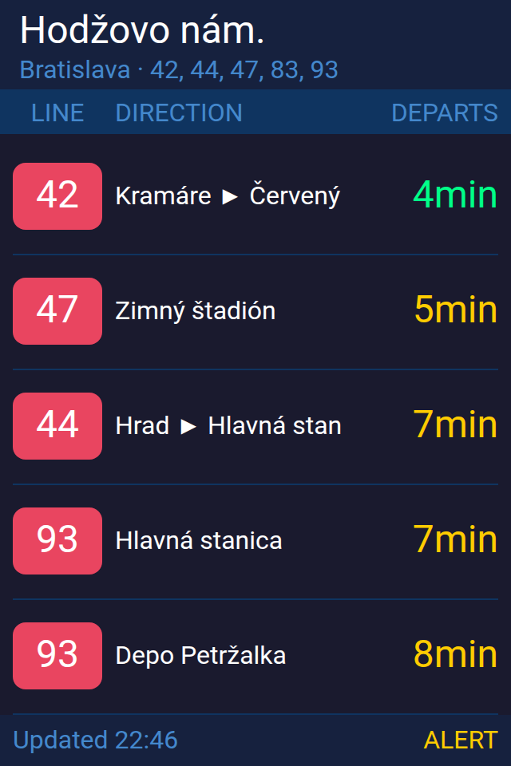

*Simulated preview of `pages.jsonl` filled with the example data. It is not a
photo of a real plate, so fonts and colours on your device may differ slightly.*

## Troubleshooting and FAQ

**How do I enable debug logging?**
On **Settings → Devices & services → IMHD.sk Departures**, open **⋮ → Enable
debug logging**, reproduce the problem, then click **Disable debug logging**.
The browser downloads the log. You can also set it in `configuration.yaml`:

```yaml
logger:
  default: warning
  logs:
    custom_components.imhd: debug
    socketio: info
    engineio: info
```

**How do I download diagnostics?**
On **Settings → Devices & services → IMHD.sk Departures**, open the **⋮** menu
of the stop's entry → **Download diagnostics**. The file contains the stop, your
options, the connection state, the current departures and a shortened copy of
the last data from imhd.sk. Please attach it to bug reports, after checking it
for anything you consider private.

**The sensors are unavailable / `binary_sensor.hodzovo_realtime_connected` is off.**
Home Assistant can't keep a connection to imhd.sk. Short drops don't matter:
the entities become unavailable only after 5 minutes without a connection.
Check that Home Assistant can reach `https://imhd.sk` (DNS, firewall, proxy,
ad blockers that block WebSockets). The attributes `last_message` and
`reconnects` show what is happening. The integration retries by itself, and
`imhd.refresh` forces a reconnect.

**A repair issue says "imhd.sk refused the connection".**
imhd.sk limits the number of connections (code −10 too many users, −11 too many
connections, −12 too many connections from your IP address). Every configured
stop uses one connection, and imhd.sk boards open in browsers on your network
connect from the same IP address. The integration retries every 15 to 60 minutes and doesn't
hammer the server. Remove stops you don't need, close other boards, then call
`imhd.refresh` to retry at once.

**The departures sensor is `unknown` at night.**
That is expected. There is no departure on the board imhd.sk sends, or none
that passes your filters, so the entities stay available with an empty list.
The state comes back with the first departure. Night lines (`N…`) show up like
any other line.

**There is no delay, `realtime` is false and the text starts with `~`.**
The departure is timetable-only, because imhd.sk has no vehicle for it. This
depends on the city, operator and trip. Vehicle-tracked departures were seen
only in Bratislava and Prešov, see [Supported cities](#supported-cities). The
time shown is the scheduled time.

**Why does `platform` show a number like `2474`?**
The stop has no platform labels on imhd.sk (Košice, Žilina and many other
cities). Use these ids in the `platforms` filter. The settings form lists them.

**The data looks stale.**
Look at `last_update` on the main sensor. imhd.sk sends only changes. The
countdown is still recomputed every 30 seconds, and the integration reconnects
by itself when a stop with departures stays silent for 15 minutes. A quiet stop
can legitimately send nothing for hours at night. This template binary sensor
warns you when the data is old:

```yaml
template:
  - binary_sensor:
      - name: "Hodzovo data stale"
        device_class: problem
        state: >
          
          {{ u is none or (now() - as_datetime(u)).total_seconds() > 900 }}
```

**A departure that imhd.sk shows is missing.**
Check your filters (`platforms`, `lines`, `exclude_lines`, `direction`) and
`walking_time`: with a walking time, departures you can't reach in time are
hidden on purpose. `max_departures` limits the list in the attributes. Use
`imhd.get_departures` with a higher `limit` to see more. imhd.sk sends only
about the next two departures of each line and destination per platform, so a
long list can skip later runs of a frequent line.

**What is line `►`?**
An unnumbered service trip, such as a vehicle going to the depot. Hide it with
`exclude_lines: ["►"]`.

**The minutes differ by one from another app.**
`minutes` is rounded down, like the imhd.sk board: `4 min` means 4 to 5
minutes. `time` is rounded to the nearest minute, and `departure` holds the
exact expected time.

**My entity ids are different from the examples.**
Entity ids come from the stop's name. A stop added without a name is named
after the stop, so `Hodžovo nám.` gives `sensor.hodzovo_nam_departures`. You
can rename entities in the UI, or set `name:` before adding the stop. The ids
are the same in every Home Assistant language.

**Can I show two platforms (or two directions) of one stop separately?**
Yes. Configure the stop twice with different names and filters. Each entry
opens its own connection, so keep the count reasonable.

## Migrating from an old pyscript / MQTT setup

You may have used a home-made setup: an HTML scraper (for example a pyscript
script or an older `imhd_*` custom component), or an add-on that bridged the
imhd.sk socket.io feed to MQTT. This integration replaces all of it:

1. Install this integration and add your stops. Use the same `name` as before
   if you want similar entity ids.
2. Remove the old parts: the MQTT sensors in `configuration.yaml`, the pyscript
   scripts, the old custom component and the bridge add-on. Running both setups
   doubles the connections to imhd.sk.
3. Update dashboards and automations to the new entities. The main mapping:

   | Old (typical) | New |
   |---|---|
   | `dep1_line`, `dep2_line`, … | `departures[0].line`, `departures[1].line`, … |
   | `dep1_dest` / `dep1_direction` | `departures[0].destination` |
   | `dep1_min` | `departures[0].minutes` (or the state of `sensor.<stop>_departure_1`) |
   | `dep1_time` | `departures[0].time` |
   | "next bus in X min" sensor | state of `sensor.<stop>_departures` |
   | openHASP pyscript | [`examples/openhasp/`](examples/openhasp/) |

If many cards or automations still read the old flat attributes, recreate them
with one template sensor instead of rewriting everything at once:

```yaml
template:
  - sensor:
      - name: "Hodzovo legacy departures"
        unique_id: hodzovo_legacy_departures
        state: "{{ states('sensor.hodzovo_departures') }}"
        attributes:
          dep1_line: >-
            
            {{ d[0].line if d | count > 0 else '' }}
          dep1_dest: >-
            
            {{ d[0].destination if d | count > 0 else '' }}
          dep1_min: >-
            
            {{ d[0].minutes if d | count > 0 else '' }}
          # ... repeat for dep2_* to dep5_* with d[1] ... d[4] and count > 1 ... > 4
```

The complete version, with `dep1_*` … `dep5_*` (line, dest, min, time), is in
[`examples/templates/template_sensors.yaml`](examples/templates/template_sensors.yaml).

## Disclaimer & fair use

- **Unofficial.** This project is not affiliated with, endorsed by or supported
  by imhd.sk (mhd.sk, o. z.) or any transport operator. It reads the same public
  feed as the imhd.sk website. All departure data is © imhd.sk and is shown as
  imhd.sk publishes it, with no guarantee of accuracy or availability. Don't
  rely on it where being late really matters.
- **Personal use only.** imhd.sk's copyright notice says that data from imhd.sk
  may not be used for anything other than personal purposes without the prior
  consent of mhd.sk, o. z. Use this integration for yourself and your
  household. **Don't use it commercially, and don't republish or redistribute
  the data**, for example on a public website, in an app, through an API or
  shared feed, or on a display for the public. For anything beyond personal
  use, ask imhd.sk first (imhd@imhd.sk).
- **Be gentle.** The integration opens **one** connection per configured stop,
  like an open departure board on the imhd.sk website. It uses HTTP only to
  look up stops: at setup, restart or reload, on `imhd.refresh` and for stop
  searches. Configure only the stops you actually use, keep their number
  reasonable (a handful, not dozens), and don't use the integration or its code
  for polling or bulk downloads. imhd.sk limits connections and may refuse them
  or block addresses that misbehave. If imhd.sk asks for changes, they will be
  made.
- **Privacy.** The integration talks only to imhd.sk. It sends the stop you
  chose. Your home location is sent only when you ask for nearby stops, in the
  config flow or with `imhd.find_stops` without coordinates. Nothing is sent
  anywhere else, and no account is needed.

## Contributing

Bug reports, ideas and pull requests are welcome. See
[CONTRIBUTING.md](CONTRIBUTING.md) for the development setup, the tests and how
to add a city. Please use the [issue templates](https://github.com/jakubfabrici/ha-imhd/issues/new/choose)
and attach diagnostics to bug reports.

## License

[MIT](LICENSE) © jakubfabrici. The code is MIT-licensed. The departure data is
© imhd.sk and isn't covered by this license.
